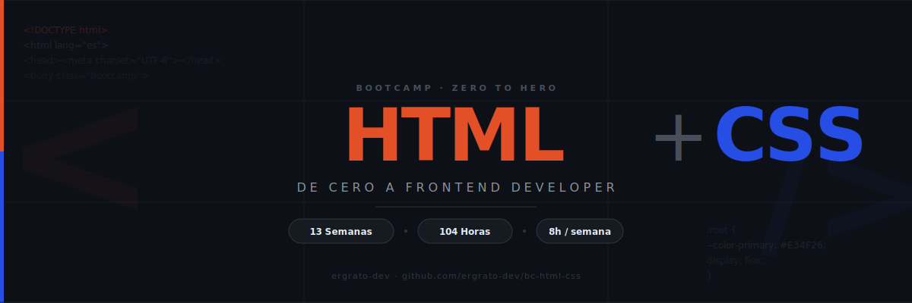

<p align="center">
  
</p>

<p align="center">
  <a href="LICENSE"></a>
  <a href="#"></a>
  <a href="#"></a>
  <a href="#"></a>
  <a href="#"></a>
  <a href="CONTRIBUTING.md"></a>
</p>

<p align="center">
  <a href="README_EN.md"></a>
</p>

---

## 📋 Descripción

Bootcamp intensivo de **13 semanas (~3 meses)** enfocado en el dominio de **HTML5 y CSS3** modernos. Diseñado para llevar a estudiantes de cero a **Frontend Developer Junior**, con énfasis en semántica, accesibilidad, layouts modernos y diseño responsive.

### 🎯 Objetivos

Al finalizar el bootcamp, los estudiantes serán capaces de:

- ✅ Configurar el entorno de desarrollo (VS Code, Live Server, DevTools)
- ✅ Inspeccionar, depurar y experimentar con HTML/CSS desde el navegador
- ✅ Escribir HTML5 semántico, estructurado y accesible
- ✅ Crear formularios, tablas y multimedia correctamente
- ✅ Dominar el modelo de caja (Box Model) y los modos de display
- ✅ Construir layouts con Flexbox y CSS Grid
- ✅ Implementar diseño responsive con Mobile-first y Media Queries
- ✅ Usar CSS Custom Properties, tipografía web y paletas de color
- ✅ Aplicar transiciones, transforms y animaciones CSS
- ✅ Usar selectores avanzados, pseudo-clases y pseudo-elementos
- ✅ Cumplir estándares de accesibilidad (ARIA, a11y) y SEO básico
- ✅ Construir un portfolio completo como proyecto final

### 🎨 ¿Por qué HTML + CSS primero?

> **Las bases sólidas hacen la diferencia** — Sin atajos, sin frameworks desde el día 1.

HTML y CSS son los pilares de cualquier interfaz web. Antes de usar frameworks como Tailwind, Bootstrap o React, es fundamental dominar el lenguaje nativo del navegador. Este bootcamp se enfoca exclusivamente en HTML5 semántico y CSS3 moderno, construyendo una base sólida que hará mejores desarrolladores independientemente del stack que usen después.

---

## 🗓️ Estructura del Bootcamp

|           Etapa           | Semanas |  Horas | Temas Principales                                          |
| :-----------------------: | :-----: | :----: | ---------------------------------------------------------- |
| **Setup & DevTools**      |    1    |   8h   | VS Code, Live Server, DevTools del navegador               |
| **HTML Fundamentos**      |   2–3   |  16h   | Estructura, etiquetas, formularios, multimedia             |
| **CSS Fundamentos**       |   4–5   |  16h   | Selectores, especificidad, Box Model, display              |
| **Layout**                |   6–8   |  24h   | Positioning, Float, Flexbox, CSS Grid                      |
| **Responsive & Estilizado** |  9–10  |  16h   | Mobile-first, Media Queries, Custom Properties             |
| **CSS Avanzado**          |  11–12  |  16h   | Transiciones, Transforms, Animaciones, Selectores avanzados |
| **Producción**            |   13    |   8h   | Semántica, ARIA, a11y, SEO, Portfolio final                |

**Total: 13 semanas** | **104 horas** de formación intensiva

---

## 📚 Contenido por Semana

Cada semana incluye:

```
bootcamp/week-XX-tema_principal/
├── README.md                 # Descripción y objetivos
├── rubrica-evaluacion.md     # Criterios de evaluación
├── 0-assets/                 # Imágenes y diagramas SVG
├── 1-teoria/                 # Material teórico
├── 2-practicas/              # Ejercicios guiados
├── 3-proyecto/               # Proyecto semanal
├── 4-recursos/               # Recursos adicionales
│   ├── ebooks-free/
│   ├── videografia/
│   └── webgrafia/
└── 5-glosario/               # Términos clave
```

### 🗂️ Semanas

| # | Carpeta | Tema |
|---|---------|------|
| 01 | `week-01-setup_y_devtools` | VS Code, Live Server, DevTools |
| 02 | `week-02-html_fundamentos` | Estructura HTML, etiquetas, semántica |
| 03 | `week-03-html_formularios_y_multimedia` | Formularios, tablas, img, video, audio |
| 04 | `week-04-css_fundamentos_y_selectores` | Sintaxis, selectores, especificidad |
| 05 | `week-05-css_box_model_y_display` | Box Model, display, overflow |
| 06 | `week-06-positioning_y_float` | Positioning, z-index, float |
| 07 | `week-07-flexbox` | Flexbox completo |
| 08 | `week-08-css_grid` | CSS Grid completo |
| 09 | `week-09-responsive_y_media_queries` | Mobile-first, breakpoints |
| 10 | `week-10-tipografia_colores_y_variables` | Google Fonts, Custom Properties |
| 11 | `week-11-transiciones_transforms_y_animaciones` | Transition, Transform, Keyframes |
| 12 | `week-12-selectores_avanzados_y_pseudo_elementos` | :nth-child, ::before, ::after |
| 13 | `week-13-semantica_accesibilidad_y_proyecto_final` | ARIA, a11y, SEO, Portfolio |

### 🔑 Componentes Clave

- 📖 **Teoría**: Conceptos fundamentales con ejemplos y diagramas SVG
- 💻 **Práctica**: Ejercicios guiados progresivos (formato descomentar)
- 📝 **Evaluación**: Evidencias de conocimiento, desempeño y producto
- 🎓 **Recursos**: Glosarios, referencias MDN y material complementario

---

## 🛠️ Herramientas

| Herramienta | Uso |
|-------------|-----|
| **VS Code** | Editor de código principal |
| **Live Server** | Recarga en vivo del navegador |
| **DevTools (Chrome/Firefox)** | Inspección, debug y experimentos CSS |
| **W3C Validator** | Validación de HTML |
| **W3C CSS Validator** | Validación de CSS |
| **Git** | Control de versiones básico |

> ❌ **No se requiere** Node.js, npm, Docker ni ningún build tool para este bootcamp.

---

## 🚀 Inicio Rápido

### Prerrequisitos

- **VS Code** instalado con la extensión **Live Server**
- **Git** para control de versiones
- Navegador moderno (Chrome o Firefox recomendado)

### 1. Clonar el Repositorio

```bash
git clone https://github.com/ergrato-dev/bc-html-css.git
cd bc-html-css
```

### 2. Instalar Extensiones de VS Code

```bash
# Abrir en VS Code
code .

# Las extensiones recomendadas aparecerán automáticamente
# O ejecutar: Ctrl+Shift+P → "Extensions: Show Recommended Extensions"
```

### 3. Navegar a la Semana Actual

```bash
cd bootcamp/week-01-setup_y_devtools
```

### 4. Abrir con Live Server

Abre el archivo `index.html` de la semana y haz clic en **"Go Live"** en la barra de estado de VS Code.

---

## 📊 Metodología de Aprendizaje

### Estrategias Didácticas

- 🎯 **Aprendizaje Basado en Proyectos (ABP)**
- 🧩 **Práctica Deliberada**
- 🔨 **Build & Break**: Construir y romper layouts para entender el comportamiento
- 🔍 **Inspect & Learn**: Uso intensivo de DevTools del navegador
- 🎮 **Live Coding**

### Distribución del Tiempo (8h/semana)

- **Teoría**: 2–2.5 horas
- **Prácticas**: 3.5–4 horas
- **Proyecto**: 1.5–2 horas

### Evaluación

Cada semana incluye tres tipos de evidencias:

1. **Conocimiento 🧠** (30%): Cuestionarios y evaluaciones teóricas
2. **Desempeño 💪** (40%): Ejercicios prácticos en clase
3. **Producto 📦** (30%): Proyecto entregable funcional (código HTML/CSS)

**Criterio de aprobación**: Mínimo 70% en cada tipo de evidencia

---

## 🤝 Contribuir

¡Las contribuciones son bienvenidas! Este es un proyecto educativo de código abierto.

### Cómo Contribuir

1. Lee la [Guía de Contribución](CONTRIBUTING.md)
2. Revisa el [Código de Conducta](CODE_OF_CONDUCT.md)
3. Fork del repositorio
4. Crea tu rama (`git checkout -b feature/nueva-funcionalidad`)
5. Commit con [Conventional Commits](https://www.conventionalcommits.org/) (`git commit -m 'feat: add new exercise'`)
6. Push a la rama (`git push origin feature/nueva-funcionalidad`)
7. Abre un Pull Request

### 📋 Áreas de Contribución

- ✨ Ejercicios adicionales
- 📚 Mejoras en documentación
- 🐛 Corrección de errores
- 🎨 Recursos visuales (diagramas SVG)
- 🌐 Traducciones
- 📹 Videos tutoriales

---

## 📞 Soporte

- 💬 **Discussions**: [GitHub Discussions](https://github.com/ergrato-dev/bc-html-css/discussions)
- 🐛 **Issues**: [GitHub Issues](https://github.com/ergrato-dev/bc-html-css/issues)

---

## ⚠️ Exención de Responsabilidad

Este repositorio es un recurso **educativo** creado con fines de aprendizaje. Al utilizarlo, aceptas los siguientes términos:

- **Solo fines educativos**: El contenido, los ejemplos de código y los proyectos están diseñados exclusivamente para la enseñanza y el aprendizaje. No constituyen asesoramiento profesional, legal ni de seguridad.
- **Sin garantías**: El material se proporciona **"tal cual"**, sin garantías de ningún tipo, expresas o implícitas, incluyendo idoneidad para un propósito particular o ausencia de errores.
- **Código en producción**: Los ejemplos de código son ilustrativos. Antes de usarlos en entornos productivos, debes realizar revisiones de accesibilidad, rendimiento y adaptación a tu contexto específico.
- **Versiones de software**: Las versiones de herramientas mencionadas pueden quedar desactualizadas. Siempre consulta la documentación oficial más reciente.
- **Limitación de responsabilidad**: Los autores y contribuidores no se responsabilizan por pérdidas de datos, daños directos o indirectos ni cualquier otro perjuicio derivado del uso de este material.
- **Responsabilidad del estudiante**: Cada estudiante es responsable de sus propias implementaciones, entornos de desarrollo y decisiones técnicas.

---

## 📄 Licencia

Este proyecto está bajo la Licencia MIT - ver el archivo [LICENSE](LICENSE) para más detalles.

---

## 🏆 Agradecimientos

- [MDN Web Docs](https://developer.mozilla.org/) - La referencia definitiva de HTML y CSS
- [W3C](https://www.w3.org/) - Por los estándares web abiertos
- [CSS-Tricks](https://css-tricks.com/) - Por las guías visuales de Flexbox y Grid
- [web.dev (Google)](https://web.dev/) - Por los recursos de rendimiento y accesibilidad
- [WHATWG](https://whatwg.org/) - Por la especificación HTML living standard
- Comunidad frontend - Por los recursos y ejemplos
- Todos los contribuidores

---

## 📚 Documentación Adicional

- [🤖 Instrucciones de Copilot](.github/copilot-instructions.md)
- [🤝 Guía de Contribución](CONTRIBUTING.md)
- [📜 Código de Conducta](CODE_OF_CONDUCT.md)
- [🔒 Política de Seguridad](SECURITY.md)

---

<p align="center">
  <strong>🎓 Bootcamp HTML + CSS - Zero to Hero</strong><br>
  <em>De cero a frontend developer en 3 meses</em>
</p>

<p align="center">
  <a href="bootcamp/week-01-setup_y_devtools">Comenzar Semana 1</a> •
  <a href="_docs">Ver Documentación</a> •
  <a href="https://github.com/ergrato-dev/bc-html-css/issues">Reportar Issue</a> •
  <a href="CONTRIBUTING.md">Contribuir</a>
</p>

<p align="center">
  Hecho con ❤️ para la comunidad de desarrolladores
</p>
