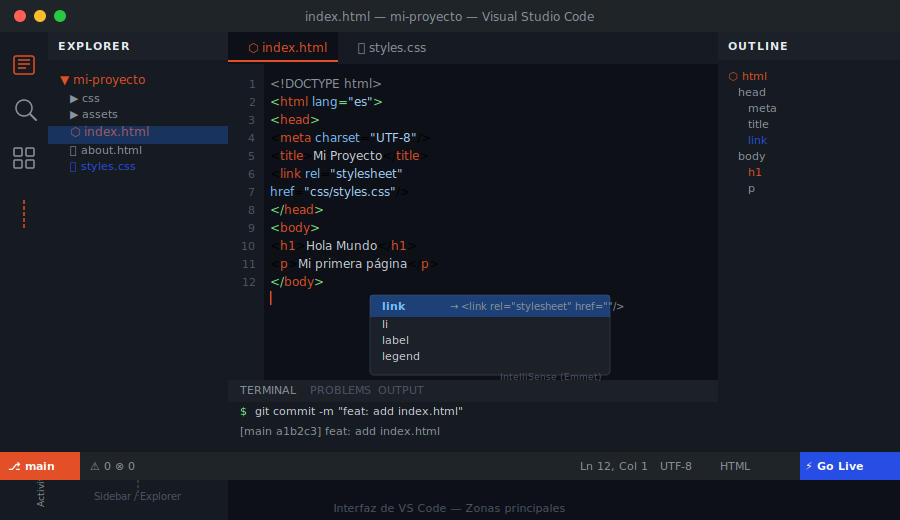

# VS Code: Setup y Extensiones

## 🎯 Objetivos

- Instalar VS Code y configurarlo para desarrollo HTML/CSS
- Conocer las extensiones esenciales y para qué sirve cada una
- Dominar los atajos de teclado más útiles para el día a día
- Aplicar una configuración de settings óptima

---

## 1. ¿Qué es VS Code?

**Visual Studio Code** es un editor de código fuente gratuito y de código abierto creado por Microsoft. Es el estándar de la industria para desarrollo web: tiene IntelliSense (autocompletado inteligente), integración nativa con Git y un ecosistema de extensiones enorme.



> 🔗 Descarga: [https://code.visualstudio.com/](https://code.visualstudio.com/)

---

## 2. Extensiones Esenciales

Instálalas con `Ctrl+Shift+X`. Busca por nombre o por el ID exacto.

| Extensión | ID | Para qué sirve |
| --------- | -- | -------------- |
| **Live Server** | `ritwickdey.LiveServer` | Recarga el navegador automáticamente al guardar |
| **Prettier** | `esbenp.prettier-vscode` | Formatea HTML y CSS automáticamente al guardar |
| **HTML CSS Support** | `ecmel.vscode-html-css` | Autocompletado de clases CSS en archivos HTML |
| **Auto Rename Tag** | `formulahendry.auto-rename-tag` | Renombra la etiqueta de cierre al cambiar la de apertura |
| **Error Lens** | `usernamehw.errorlens` | Muestra errores y avisos directamente en la línea de código |
| **Color Highlight** | `naumovs.color-highlight` | Muestra el color real de cada valor CSS en el editor |

---

## 3. Settings Recomendados

`Ctrl+Shift+P` → **Open User Settings (JSON)** y agrega:

```json
{
  "editor.formatOnSave": true,
  "editor.defaultFormatter": "esbenp.prettier-vscode",
  "editor.fontSize": 14,
  "editor.tabSize": 2,
  "editor.insertSpaces": true,
  "editor.wordWrap": "on",
  "editor.guides.indentation": true,
  "files.autoSave": "afterDelay",
  "files.autoSaveDelay": 1000,
  "workbench.colorTheme": "Default Dark Modern"
}
```

Además, crea `.prettierrc` en la raíz de cada proyecto:

```json
{
  "printWidth": 100,
  "tabWidth": 2,
  "singleQuote": false,
  "htmlWhitespaceSensitivity": "css"
}
```

---

## 4. Atajos de Teclado Esenciales

| Atajo | Acción |
| ----- | ------ |
| `Ctrl+S` | Guardar archivo |
| `Ctrl+Z` / `Ctrl+Y` | Deshacer / Rehacer |
| `Ctrl+/` | Comentar / descomentar línea |
| `Alt+↑` / `Alt+↓` | Mover línea hacia arriba / abajo |
| `Shift+Alt+↓` | Duplicar línea hacia abajo |
| `Ctrl+D` | Seleccionar la siguiente ocurrencia igual |
| `Alt+Click` | Agregar cursor adicional (multiedición) |
| `Ctrl+P` | Navegador rápido de archivos |
| `Ctrl+Shift+P` | Paleta de comandos (acceso a todo) |
| `Ctrl+\`` | Abrir / cerrar terminal integrada |

---

## 5. Emmet: HTML y CSS sin escribir de más

VS Code incluye **Emmet** de serie: abreviaciones que se expanden a código completo con `Tab`.

```
 Escribes               →  Genera
 ──────────────────────────────────────────────────────
 !                      →  plantilla HTML5 completa
 h1                     →  <h1></h1>
 p.intro                →  <p class="intro"></p>
 ul>li*3                →  <ul> con 3 <li>
 section.hero>h1+p      →  <section class="hero"><h1></h1><p></p></section>
 df                     →  display: flex;
 jcc                    →  justify-content: center;
 m1rem                  →  margin: 1rem;
```

> 🔗 Referencia completa: [https://docs.emmet.io/cheat-sheet/](https://docs.emmet.io/cheat-sheet/)

---

## 6. Plantilla HTML5 con Emmet

Escribe `!` en un archivo `.html` vacío y presiona `Tab`. VS Code genera automáticamente:

```html
<!DOCTYPE html>
<html lang="en">
  <head>
    <meta charset="UTF-8" />
    <meta name="viewport" content="width=device-width, initial-scale=1.0" />
    <title>Document</title>
  </head>
  <body></body>
</html>
```

> ⚠️ Cambia siempre `lang="en"` por `lang="es"` si el contenido es en español, y personaliza el `<title>`.

---

## 7. Abrir Siempre la Carpeta Raíz

VS Code trabaja con **carpetas** como unidad de proyecto. Abre siempre la carpeta raíz (no un archivo suelto):

```
File → Open Folder  (o arrastra la carpeta sobre el icono de VS Code)
```

Al abrir la carpeta completa:
- La búsqueda con `Ctrl+Shift+F` abarca todo el proyecto
- Live Server sirve los archivos desde la raíz correcta
- Git integrado detecta el repositorio automáticamente

---

## 📚 Recursos Adicionales

- [VS Code Docs](https://code.visualstudio.com/docs)
- [Atajos de teclado para Linux (PDF)](https://code.visualstudio.com/shortcuts/keyboard-shortcuts-linux.pdf)
- [Emmet Cheat Sheet](https://docs.emmet.io/cheat-sheet/)

---

## ✅ Checklist de Verificación

- [ ] VS Code instalado con las 6 extensiones de la tabla
- [ ] `formatOnSave: true` y `tabSize: 2` aplicados en settings
- [ ] `.prettierrc` creado en la raíz del proyecto
- [ ] Puedes generar una plantilla HTML5 con `!` + `Tab`
- [ ] Conoces al menos 5 atajos de la tabla de memoria
