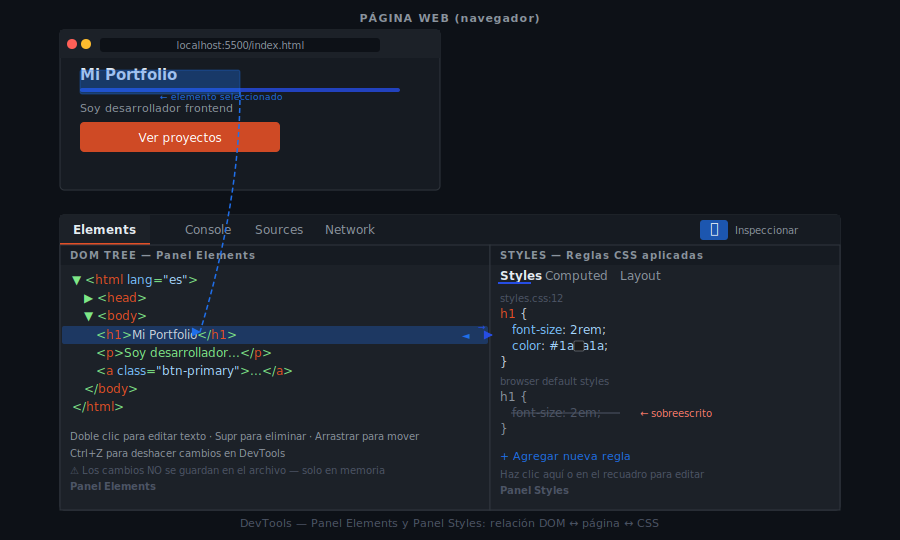

# DevTools: Paneles Elements y Styles

## 🎯 Objetivos

- Abrir DevTools y navegar con fluidez entre sus paneles
- Seleccionar cualquier elemento del DOM con el inspector
- Leer y editar HTML directamente en el panel Elements
- Modificar reglas CSS en el panel Styles y ver el resultado al instante

---

## 1. ¿Qué son las DevTools?

Las **herramientas del desarrollador** (DevTools) son paneles integrados en cualquier navegador moderno que permiten inspeccionar, editar y depurar páginas web en tiempo real.

**Cómo abrirlas:**

| Acción | Atajo |
| ------ | ----- |
| Abrir / cerrar DevTools | `F12` o `Ctrl+Shift+I` |
| Abrir en el elemento bajo el cursor | `Clic derecho → Inspeccionar` |
| Abrir forzando el panel Console | `Ctrl+Shift+J` |

> 💡 Los cambios en DevTools son **temporales**: se pierden al recargar la página. Son el espacio perfecto para experimentar antes de escribir en el código.

---

## 2. Panel Elements: El Árbol del DOM

El panel **Elements** muestra el HTML de la página como un árbol de nodos interactivo (el DOM). Desde aquí puedes:

- Ver y navegar la estructura del documento
- Expandir y colapsar etiquetas con las flechas `▶`
- Editar HTML en vivo haciendo doble clic en cualquier etiqueta o texto
- Agregar, mover o eliminar nodos

### Seleccionar un elemento

```
Método 1 — Inspector (🔍):
  Clic en el icono de flecha ↖ (esquina superior izquierda de DevTools)
  Luego clic en cualquier parte de la página
  → El elemento queda resaltado en el panel Elements

Método 2 — Clic derecho:
  Clic derecho sobre cualquier elemento en la página
  → "Inspeccionar"
  → El elemento queda seleccionado en el árbol
```

### Editar HTML en vivo

```
1. Selecciona el elemento en el panel Elements
2. Doble clic sobre el texto o la etiqueta que quieres cambiar
3. Escribe el nuevo valor y presiona Enter
→ El cambio se refleja al instante en la página
```



---

## 3. Panel Styles: CSS en Tiempo Real

El panel **Styles** aparece a la derecha (o abajo) del panel Elements cuando seleccionas un nodo. Muestra **todas las reglas CSS** que afectan a ese elemento, ordenadas por especificidad.

### Leer el panel Styles

```
element.style { }          ← Estilos en línea (atributo style="")
.mi-clase { }              ← Tu CSS (de mayor a menor especificidad)
  color: red;              ← Propiedad activa
  ~~font-size: 14px;~~     ← Propiedad tachada = sobreescrita por otra regla
a { }                      ← Estilos heredados del navegador (user agent)
```

### Modificar estilos en vivo

```
1. Selecciona el elemento con el inspector
2. En el panel Styles, haz clic en el valor que quieres cambiar
   Ejemplo: haz clic en "16px" de font-size
3. Escribe el nuevo valor (p.ej. "24px") y presiona Enter
→ El cambio se aplica al instante en la página

Para desactivar una propiedad: desmarca la casilla a su izquierda
Para agregar una propiedad nueva: clic en cualquier espacio vacío del bloque
```

### Añadir una nueva regla CSS completa

```
Clic en el icono "+" (New Style Rule) en la barra del panel Styles
→ Crea un nuevo bloque con el selector del elemento seleccionado
→ Escribe la propiedad y valor que quieras probar
```

---

## 4. Resalte Visual del Box Model

Cuando seleccionas un elemento, DevTools resalta su caja con colores:

| Color | Zona |
| ----- | ---- |
| 🟦 Azul | `content` — el contenido (texto, imagen) |
| 🟩 Verde | `padding` — espacio interior |
| 🟧 Naranja | `margin` — espacio exterior |
| 🟨 Amarillo | `border` — borde del elemento |

> 💡 El Box Model se studiará en profundidad en la Semana 5. Por ahora, identifica visualmente cada zona cuando pases el cursor sobre un elemento en el panel Elements.

---

## 5. Buscar en el DOM

Con el panel Elements abierto, usa `Ctrl+F` para buscar en el árbol del DOM:
- Por selector CSS: `.mi-clase`, `#mi-id`, `div`
- Por texto: busca cualquier cadena de texto visible
- Por atributo: `[data-id]`, `[type="email"]`

---

## 6. Copiar Estilos para tu Código

Cuando encuentras un estilo en DevTools que quieres aplicar en tu CSS:

```
1. Selecciona el elemento con el inspector
2. En el panel Styles, localiza la propiedad y valor que necesitas
3. Clic derecho sobre la propiedad → "Copy declaration"
   (o simplemente selecciona el texto y copia con Ctrl+C)
4. Pega en tu archivo CSS
```

También puedes usar el botón **"Copy all declarations"** para copiar un bloque completo de reglas CSS del elemento.

> 💡 Esta técnica es útil cuando experimentas con valores en DevTools y encuentras los números perfectos — copias directamente en lugar de recordarlos.

---

## 📚 Recursos Adicionales

- [MDN — Inspeccionar y editar HTML](https://developer.mozilla.org/es/docs/Tools/Page_Inspector/How_to/Examine_and_edit_HTML)
- [MDN — Examinar y editar CSS](https://developer.mozilla.org/es/docs/Tools/Page_Inspector/How_to/Examine_and_edit_CSS)
- [Chrome DevTools — Elements panel](https://developer.chrome.com/docs/devtools/dom/)

---

## ✅ Checklist de Verificación

- [ ] Sabes abrir DevTools con `F12` y con clic derecho → Inspeccionar
- [ ] Puedes seleccionar cualquier elemento de la página con el inspector (🔍)
- [ ] Puedes editar el texto de un `<h1>` directamente en el panel Elements
- [ ] Puedes cambiar el `color` de un elemento en el panel Styles
- [ ] Identificas las propiedades tachadas (sobreescritas) en el panel Styles
- [ ] Sabes dónde están los colores del Box Model (azul/verde/naranja)
