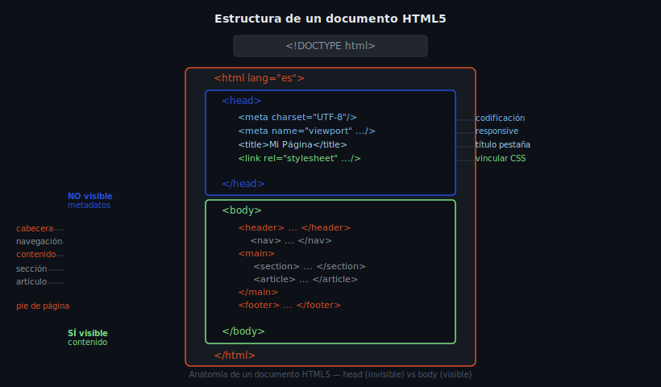

# 01 — Estructura de un documento HTML

## 🎯 Objetivos

- Comprender la anatomía de un documento HTML5
- Dominar las etiquetas obligatorias de `<head>`
- Identificar las zonas semánticas principales de `<body>`

---

## 1. La declaración DOCTYPE

La primera línea de **todo** documento HTML debe ser el DOCTYPE. Le indica al navegador que use el estándar HTML5 (sin DOCTYPE, el navegador entra en "quirks mode" y el comportamiento es impredecible).

```html
<!DOCTYPE html>
```

> Es la única "etiqueta" que no tiene etiqueta de cierre y no distingue mayúsculas/minúsculas, pero por convención se escribe en mayúsculas.

---

## 2. La etiqueta `<html>`

Envuelve todo el documento. El atributo `lang` es obligatorio: indica el idioma del contenido y es fundamental para lectores de pantalla y motores de búsqueda.

```html
<!DOCTYPE html>
<html lang="es">
  <!-- todo el documento va aquí -->
</html>
```

Códigos de idioma frecuentes: `es` (español), `en` (inglés), `pt` (portugués), `fr` (francés).

---

## 3. El elemento `<head>`

No es visible en la página pero contiene metadatos esenciales. Etiquetas obligatorias:

```html
<head>
  <!-- 1. Codificación de caracteres (siempre la primera) -->
  <meta charset="UTF-8" />

  <!-- 2. Viewport para diseño responsivo -->
  <meta name="viewport" content="width=device-width, initial-scale=1.0" />

  <!-- 3. Título de la pestaña del navegador -->
  <title>Título descriptivo de la página</title>

  <!-- 4. Vinculación de CSS externo -->
  <link rel="stylesheet" href="css/styles.css" />
</head>
```

Metadatos opcionales pero recomendados:

```html
<!-- Descripción para SEO (máximo 160 caracteres) -->
<meta name="description" content="Descripción de la página para buscadores." />
```

---

## 4. El elemento `<body>` y la semántica HTML5

HTML5 introdujo etiquetas que describen el **rol** del contenido, no solo su apariencia. Esto mejora la accesibilidad, el SEO y la legibilidad del código.



```html
<body>
  <header>
    <!-- Cabecera del sitio: logo, nombre, slogan -->
    <nav>
      <!-- Navegación principal -->
    </nav>
  </header>

  <main>
    <!-- Contenido principal y único de la página -->
    <section>
      <!-- Grupo temático de contenido relacionado -->
      <article>
        <!-- Contenido autocontenido (post, noticia, tarjeta) -->
      </article>
    </section>
    <aside>
      <!-- Contenido secundario o complementario -->
    </aside>
  </main>

  <footer>
    <!-- Pie de página: copyright, links secundarios -->
  </footer>
</body>
```

### Cuándo usar cada etiqueta:

| Etiqueta | Usar cuando… |
|----------|-------------|
| `<header>` | Cabecera del sitio o de una sección |
| `<nav>` | Grupo de links de navegación |
| `<main>` | Contenido principal (solo uno por página) |
| `<section>` | Grupo temático, siempre con heading |
| `<article>` | Contenido autocontenido (puede leerse solo) |
| `<aside>` | Contenido relacionado pero no esencial |
| `<footer>` | Pie de página o de sección |
| `<div>` | Contenedor genérico cuando no existe etiqueta semántica |

---

## 5. Comentarios en HTML

Los comentarios no se muestran en el navegador pero son útiles para documentar el código:

```html
<!-- Esto es un comentario de una línea -->

<!--
  Comentario
  de múltiples
  líneas
-->
```

---

## ✅ Checklist

- [ ] El documento comienza con `<!DOCTYPE html>`
- [ ] `<html>` tiene `lang="es"` (u otro idioma apropiado)
- [ ] `<meta charset="UTF-8">` es la primera etiqueta dentro de `<head>`
- [ ] `<meta name="viewport" ...>` presente en `<head>`
- [ ] `<title>` descriptivo y único por página
- [ ] `<main>` aparece solo una vez en el documento
- [ ] Solo se usa `<div>` cuando no existe etiqueta semántica adecuada
