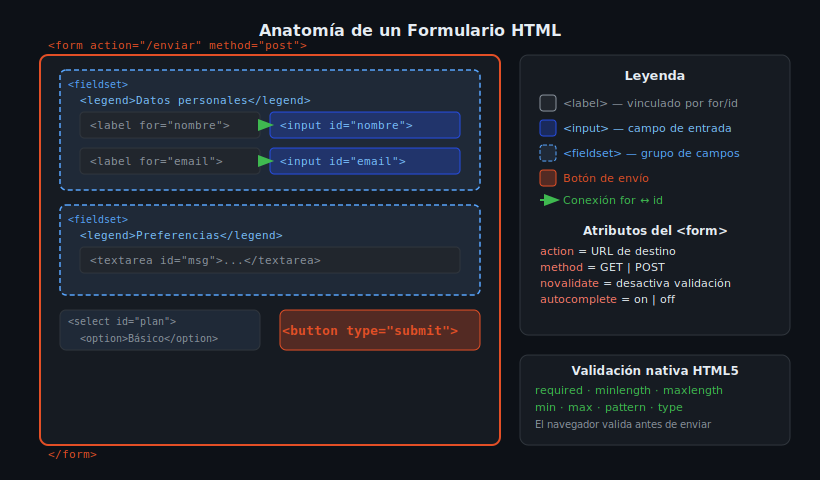

# Formularios HTML

## 🎯 Objetivos

- Crear formularios accesibles con las etiquetas correctas
- Asociar `<label>` con `<input>` para accesibilidad
- Seleccionar el tipo de input apropiado para cada dato
- Agrupar campos relacionados con `<fieldset>` y `<legend>`
- Implementar validación nativa HTML5

---

## 1. Anatomía de un formulario



Un formulario HTML tiene tres partes esenciales:

```html
<!-- action: URL donde se envían los datos -->
<!-- method: GET (visible en URL) o POST (en el cuerpo de la petición) -->
<form action="/enviar" method="post">

  <!-- Grupo de campos relacionados -->
  <fieldset>
    <legend>Información personal</legend>

    <!-- label vinculado al input mediante for="id" -->
    <label for="nombre">Nombre completo</label>
    <input type="text" id="nombre" name="nombre" required />

  </fieldset>

  <button type="submit">Enviar</button>
</form>
```

> **¿Por qué vincular `<label>` con `<input>`?**
> Al hacer clic en el label, el input recibe el foco. Los lectores de pantalla anuncian el label al llegar al input. Sin esta asociación el formulario es inaccesible.

---

## 2. Tipos de `<input>`

| Tipo | Uso | Ejemplo |
|------|-----|---------|
| `text` | Texto libre de una línea | Nombre, ciudad |
| `email` | Correo electrónico (valida formato) | ana@ejemplo.com |
| `password` | Contraseña (oculta el texto) | ******* |
| `tel` | Teléfono | +52 123 456 7890 |
| `number` | Número (con min/max/step) | Edad: 25 |
| `date` | Selector de fecha | 2026-03-15 |
| `checkbox` | Opción de marcado múltiple | ✓ Acepto términos |
| `radio` | Opción de selección única | ○ Masculino ● Femenino |
| `file` | Subir archivo | Seleccionar imagen |
| `hidden` | Dato oculto (no visible al usuario) | Token CSRF |
| `submit` | Botón de envío (preferir `<button>`) | Enviar |

```html
<!-- Ejemplo completo con tipos variados -->
<form action="/registro" method="post">

  <fieldset>
    <legend>Datos de acceso</legend>

    <label for="email">Correo electrónico</label>
    <input type="email" id="email" name="email"
           placeholder="tu@correo.com" required />

    <label for="password">Contraseña</label>
    <input type="password" id="password" name="password"
           minlength="8" required />
  </fieldset>

  <fieldset>
    <legend>Preferencias</legend>

    <!-- Radio buttons: mismo name = grupo exclusivo -->
    <p>Género:</p>
    <label><input type="radio" name="genero" value="m" /> Masculino</label>
    <label><input type="radio" name="genero" value="f" /> Femenino</label>
    <label><input type="radio" name="genero" value="otro" /> Prefiero no decir</label>

    <!-- Checkbox independiente -->
    <label>
      <input type="checkbox" name="newsletter" value="si" />
      Suscribirme al newsletter
    </label>
  </fieldset>

  <!-- <button> es preferible a <input type="submit">: más flexible para estilar -->
  <button type="submit">Crear cuenta</button>
  <button type="reset">Limpiar formulario</button>
</form>
```

---

## 3. Elementos de selección y texto largo

```html
<!-- Select: lista desplegable -->
<label for="pais">País</label>
<select id="pais" name="pais" required>
  <option value="">— Selecciona tu país —</option>
  <option value="mx">México</option>
  <option value="ar">Argentina</option>
  <option value="co">Colombia</option>
  <option value="es">España</option>
</select>

<!-- Textarea: texto multilinea -->
<label for="mensaje">Mensaje</label>
<textarea id="mensaje" name="mensaje"
          rows="5" cols="40"
          placeholder="Escribe tu mensaje aquí..."
          maxlength="500"
          required></textarea>

<!-- datalist: combo de texto + sugerencias -->
<label for="ciudad">Ciudad</label>
<input type="text" id="ciudad" name="ciudad" list="ciudades-sugeridas" />
<datalist id="ciudades-sugeridas">
  <option value="Ciudad de México" />
  <option value="Guadalajara" />
  <option value="Monterrey" />
</datalist>
```

---

## 4. Validación nativa HTML5

```html
<!-- required: campo obligatorio -->
<input type="text" required />

<!-- minlength / maxlength: longitud del texto -->
<input type="text" minlength="3" maxlength="50" />

<!-- min / max: valor numérico o de fecha -->
<input type="number" min="18" max="99" />
<input type="date" min="2020-01-01" max="2026-12-31" />

<!-- pattern: expresión regular personalizada -->
<!-- Este pattern acepta solo letras y espacios -->
<input type="text" pattern="[A-Za-záéíóúÁÉÍÓÚñÑ\s]+" title="Solo letras y espacios" />

<!-- autocomplete: ayuda al navegador a autocompletar -->
<input type="email" autocomplete="email" />
<input type="tel" autocomplete="tel" />
```

> **Nota:** La validación HTML5 es útil como primera línea, pero **nunca** reemplaza la validación del servidor. Siempre valida en el backend también.

---

## ✅ Checklist de verificación

- [ ] Todo `<input>` tiene un `<label>` con `for` = `id` del input
- [ ] Se usa `<fieldset>` + `<legend>` para agrupar campos relacionados
- [ ] El tipo de input es el correcto para cada dato
- [ ] Los campos obligatorios tienen `required`
- [ ] `<button type="submit">` en lugar de `<input type="submit">`
- [ ] `autocomplete` en campos de datos personales
- [ ] `placeholder` no reemplaza al `<label>`

## 📚 Recursos

- [MDN — Formularios HTML](https://developer.mozilla.org/es/docs/Learn/Forms)
- [MDN — `<input>` tipos](https://developer.mozilla.org/es/docs/Web/HTML/Element/input)
