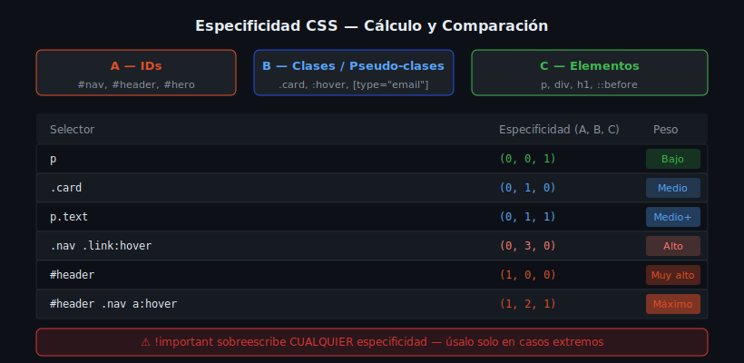

# Especificidad y Cascada

## 🎯 Objetivos

- Calcular la especificidad de cualquier selector CSS
- Entender el orden de resolución de la cascada
- Saber cuándo y cómo usar `!important` (raramente)

---

## 1. ¿Qué es la especificidad?

Cuando dos reglas aplican al mismo elemento, el **selector más específico** gana. La especificidad se calcula como tres valores `(A, B, C)`:



| Categoría | Qué cuenta | Valor |
|-----------|-----------|-------|
| **A** — IDs | `#nav`, `#hero` | 1,0,0 por ID |
| **B** — Clases, pseudo-clases, atributos | `.card`, `:hover`, `[type]` | 0,1,0 por cada uno |
| **C** — Elementos, pseudo-elementos | `p`, `div`, `::before` | 0,0,1 por cada uno |

```css
/* Especificidad: 0,0,1 — solo un elemento */
p { color: gray; }

/* Especificidad: 0,1,0 — una clase */
.text { color: blue; }

/* Especificidad: 0,1,1 — una clase + un elemento */
p.text { color: green; }

/* Especificidad: 1,0,0 — un ID */
#main { color: red; }
```

Para el elemento `<p class="text" id="main">`:
- `p` → gris (0,0,1)
- `.text` → azul (0,1,0)
- `p.text` → verde (0,1,1)
- `#main` → **rojo** (1,0,0) ← el ID gana

---

## 2. Calculando especificidad — ejemplos

```css
/* 0,0,1 */
h1 { }

/* 0,1,0 */
.hero { }

/* 0,1,1 */
nav a { }

/* 0,2,0 */
.nav .link { }

/* 0,2,1 */
.nav a:hover { }

/* 1,0,0 */
#header { }

/* 1,1,0 */
#header .logo { }

/* 0,3,1 */
.nav .list .item a { }
```

> El selector universal `*` tiene especificidad `0,0,0`.

---

## 3. La Cascada — orden de resolución

Cuando dos reglas tienen la **misma especificidad**, gana la que viene **después** en el código (más abajo en el archivo o en un archivo cargado después):

```css
/* Esta regla se aplica primero */
.btn {
  background: blue;
}

/* Esta regla la sobreescribe (misma especificidad, pero viene después) */
.btn {
  background: green; /* ← Este gana */
}
```

**Orden de prioridad de la cascada (de menor a mayor):**

1. Estilos del navegador (user-agent stylesheet)
2. Estilos del usuario (configuración del navegador)
3. Estilos del autor (tu CSS)
4. Estilos del autor con `!important`
5. Estilos del usuario con `!important`

---

## 4. `!important` — usar con extrema precaución

```css
/* ❌ MAL — rompe la cascada y es difícil de depurar */
.btn {
  background: red !important;
}

/* Ahora para sobreescribir esto necesitas otro !important ← espiral */
#hero .btn {
  background: blue !important; /* solo gana porque viene después */
}
```

**Cuándo sí usar `!important` (rarísimamente):**
- Clases de utilidad que deben aplicarse siempre (ej: `.visually-hidden`)
- Sobreescribir estilos de terceros que no puedes modificar

---

## 5. Herramientas de diagnóstico

En DevTools (F12 → pestaña Styles):
- Los estilos tachados son sobreescritos
- El texto "Specificity" en el tooltip muestra (A, B, C)
- Los estilos del usuario-agente aparecen al final con baja prioridad

```css
/* Técnica: aumentar especificidad sin IDs */
/* En lugar de #nav .link, hacer: */
.nav.nav .link { /* 0,3,0 — agrega .nav dos veces */ }

/* Mejor solución: refactorizar el HTML o el CSS */
```

---

## 6. La especificidad del selector `:where()` es cero

```css
/* :where() tiene especificidad 0,0,0 — útil para resets */
:where(h1, h2, h3, h4) {
  margin: 0;
  line-height: 1.2;
}
/* Cualquier selector específico del autor sobreescribirá esto fácilmente */
```

---

## ✅ Checklist de verificación

- [ ] Evito IDs para estilos CSS
- [ ] Calculo la especificidad al depurar conflictos
- [ ] No uso `!important` salvo casos muy justificados
- [ ] Verifico estilos tachados en DevTools para encontrar overrides

## 📚 Recursos

- [MDN — Especificidad](https://developer.mozilla.org/es/docs/Web/CSS/Specificity)
- [Specificity Calculator interactivo](https://specificity.keegan.st/)
