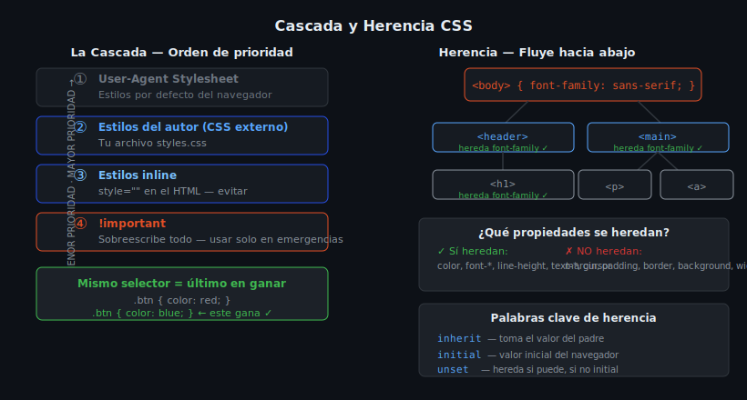

# Herencia y Reset CSS

## 🎯 Objetivos

- Saber qué propiedades se heredan en CSS y cuáles no
- Usar `inherit`, `initial` y `unset` deliberadamente
- Implementar un CSS Reset básico para normalizar los estilos del navegador

---

## 1. Herencia en CSS



Algunas propiedades CSS se **heredan** automáticamente de los elementos padre a los hijos:

```html
<div class="container">
  <p>Este párrafo hereda el color y la fuente del contenedor</p>
</div>
```

```css
.container {
  color: #e6edf3;
  font-family: system-ui, sans-serif;
  font-size: 1rem;
  line-height: 1.6;
}
/* El <p> hereda todas estas propiedades automáticamente */
```

### Propiedades que sí se heredan

- Tipografía: `color`, `font-family`, `font-size`, `font-weight`, `font-style`, `line-height`
- Texto: `text-align`, `text-indent`, `letter-spacing`, `word-spacing`
- Listas: `list-style`, `list-style-type`
- Visibilidad: `visibility`
- Cursor: `cursor`

### Propiedades que NO se heredan

- Caja: `margin`, `padding`, `border`, `width`, `height`
- Fondo: `background`, `background-color`
- Layout: `display`, `position`, `top`, `left`, `float`
- Bordes: `border`, `outline`

---

## 2. Palabras clave de herencia

```css
.child {
  /* inherit: toma el valor del elemento padre */
  color: inherit;

  /* initial: restaura el valor por defecto del navegador */
  font-size: initial; /* equivale a: font-size: medium; */

  /* unset: hereda si la propiedad es heredable, si no aplica initial */
  border: unset;

  /* revert: restaura el estilo del user-agent stylesheet */
  display: revert;
}
```

Ejemplo práctico:

```css
/* El <a> dentro de .footer hereda el color del footer, no el azul por defecto */
.footer a {
  color: inherit;
  text-decoration: underline;
}
```

---

## 3. CSS Reset — Por qué es necesario

Cada navegador aplica su propia hoja de estilos por defecto (**user-agent stylesheet**):
- Chrome aplica `margin: 8px` al `<body>`
- Firefox aplica diferentes defaults a listas y formularios
- Safari tiene distintos estilos en botones y inputs

Un **CSS Reset** elimina o normaliza estos defaults para tener un punto de partida consistente.

---

## 4. Reset mínimo recomendado

```css
/* === RESET MÍNIMO === */

/* box-sizing: border-box hace que padding y border
   se incluyan EN el width, no se sumen */
*,
*::before,
*::after {
  box-sizing: border-box;
}

/* Elimina márgenes y paddings inconsistentes */
* {
  margin: 0;
  padding: 0;
}

/* Mejora la tipografía base */
html {
  font-size: 16px; /* 1rem = 16px */
  -webkit-text-size-adjust: 100%;
}

body {
  line-height: 1.5;
  -webkit-font-smoothing: antialiased;
}

/* Imágenes responsivas por defecto */
img,
picture,
video,
canvas,
svg {
  display: block;
  max-width: 100%;
}

/* Inputs heredan la fuente del documento */
input,
button,
textarea,
select {
  font: inherit;
}

/* Breakpoints de texto más predecibles */
p,
h1,
h2,
h3,
h4,
h5,
h6 {
  overflow-wrap: break-word;
}
```

> **Alternativa:** [Normalize.css](https://necolas.github.io/normalize.css/) preserva estilos útiles del navegador en lugar de quitarlos todos.

---

## 5. Variables CSS para tokens base

Después del reset, la mejor práctica es definir variables en `:root`:

```css
:root {
  /* Tipografía */
  --font-sans: system-ui, -apple-system, BlinkMacSystemFont, "Segoe UI", sans-serif;
  --font-mono: "JetBrains Mono", "Fira Code", monospace;

  /* Escala tipográfica */
  --text-sm: 0.875rem;
  --text-base: 1rem;
  --text-lg: 1.125rem;
  --text-xl: 1.25rem;
  --text-2xl: 1.5rem;
  --text-3xl: 1.875rem;

  /* Espaciado */
  --space-1: 0.25rem;
  --space-2: 0.5rem;
  --space-4: 1rem;
  --space-8: 2rem;

  /* Colores */
  --color-bg: #0d1117;
  --color-surface: #161b22;
  --color-border: #30363d;
  --color-text: #e6edf3;
  --color-primary: #e34f26;
}
```

---

## ✅ Checklist de verificación

- [ ] CSS Reset aplicado antes de todos los demás estilos
- [ ] `box-sizing: border-box` en `*`
- [ ] Variables CSS en `:root` para valores reutilizables
- [ ] `font: inherit` en inputs y botones
- [ ] `max-width: 100%` en imágenes

## 📚 Recursos

- [MDN — Herencia](https://developer.mozilla.org/es/docs/Learn/CSS/Building_blocks/Cascade_and_inheritance)
- [Josh Comeau's CSS Reset](https://www.joshwcomeau.com/css/custom-css-reset/)
