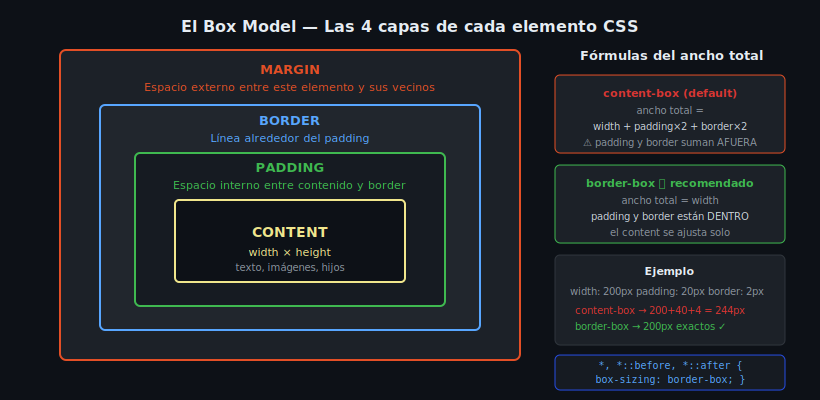

# Box Model — El Modelo de Caja CSS

## 🎯 Objetivos

- Visualizar los 4 componentes de la caja CSS
- Comprender `box-sizing: border-box` y por qué siempre se usa
- Calcular el ancho total de un elemento

---

## 1. Qué es el Box Model

En CSS, **todo elemento es una caja rectangular**. Esa caja tiene 4 capas, de adentro hacia afuera:

```
┌─────────────────────────────────────────┐
│               MARGIN                    │
│  ┌───────────────────────────────────┐  │
│  │            BORDER                 │  │
│  │  ┌─────────────────────────────┐  │  │
│  │  │          PADDING            │  │  │
│  │  │  ┌───────────────────────┐  │  │  │
│  │  │  │       CONTENT         │  │  │  │
│  │  │  │  width × height       │  │  │  │
│  │  │  └───────────────────────┘  │  │  │
│  │  └─────────────────────────────┘  │  │
│  └───────────────────────────────────┘  │
└─────────────────────────────────────────┘
```



| Capa | Qué es |
|------|--------|
| **content** | El área donde va el texto, imágenes o hijos |
| **padding** | Espacio interno entre el content y el border |
| **border** | Línea alrededor del padding |
| **margin** | Espacio externo entre este elemento y sus vecinos |

---

## 2. content-box vs border-box

Por defecto, el navegador usa `box-sizing: content-box`. Esto significa que `width` y `height` **solo cuentan el contenido**. Los paddings y borders se **suman** por fuera.

```css
/* content-box (comportamiento por defecto — confuso) */
.caja {
  width: 200px;
  padding: 20px;
  border: 2px solid;
  /* ⚠️ Ancho real en pantalla = 200 + 20 + 20 + 2 + 2 = 244px */
}
```

Con `border-box`, el `width` **incluye** padding y border:

```css
/* border-box (intuitivo — siempre prefiero este) */
.caja {
  box-sizing: border-box;
  width: 200px;
  padding: 20px;
  border: 2px solid;
  /* ✅ Ancho real en pantalla = 200px exactos */
  /* El content se ajusta para caber: 200 - 20 - 20 - 2 - 2 = 156px */
}
```

### La regla de oro: reset con border-box

Aplica esto en **todos** tus proyectos al inicio:

```css
/* Reset esencial — aplicar siempre */
*,
*::before,
*::after {
  box-sizing: border-box;
}
```

---

## 3. Ver el Box Model en DevTools

En Chrome/Firefox, abre DevTools con `F12` → pestaña **Elements** → panel lateral **Computed**. Verás el diagrama interactivo del Box Model con los valores reales de cada capa.

```
         16           ← margin-top
   ┌──────────────┐
8  │   2 border   │  8   ← margin-left/right = 8
   │  ┌────────┐  │
   │16│        │16│   ← padding izq/der = 16
   │  └────────┘  │
   └──────────────┘
         16
```

---

## 4. Ejemplos prácticos

```css
/* ✅ Tarjeta con espaciado correcto usando border-box */
.card {
  box-sizing: border-box;
  width: 320px;
  padding: 1.5rem;         /* espacio interno uniforme */
  border: 1px solid #30363d;
  border-radius: 8px;
  /* El contenido tendrá: 320 - (1.5rem × 2) - (1px × 2) de ancho */
}

/* ✅ Ancho relativo con padding controlado */
.column {
  box-sizing: border-box;
  width: 50%;
  padding: 1rem;
  /* Exactamente la mitad del padre, con padding incluido */
}
```

---

## 5. Propiedad outline — fuera del Box Model

`outline` es un contorno visual que **no ocupa espacio** en el Box Model. Es muy útil para accesibilidad (`:focus-visible`) porque no desplaza el layout.

```css
button:focus-visible {
  outline: 3px solid #58a6ff;
  outline-offset: 2px; /* distancia entre el border y el outline */
}
```

---

## ✅ Checklist de verificación

- [ ] Puedo listar los 4 componentes del Box Model de adentro a afuera
- [ ] Sé calcular el ancho total de un elemento con `content-box`
- [ ] Tengo `box-sizing: border-box` como reset en todos mis proyectos
- [ ] Puedo ver el Box Model en DevTools → Computed

## 📚 Recursos

- [MDN — The Box Model](https://developer.mozilla.org/es/docs/Learn_web_development/Core/Styling_basics/Box_model)
- [MDN — box-sizing](https://developer.mozilla.org/es/docs/Web/CSS/box-sizing)
