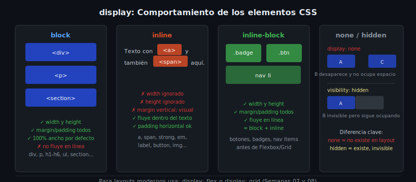

# Display y Overflow

## 🎯 Objetivos

- Dominar los valores de `display` más utilizados: `block`, `inline`, `inline-block`, `none`
- Entender la diferencia entre `display: none` y `visibility: hidden`
- Controlar qué ocurre cuando el contenido desborda su contenedor con `overflow`

---

## 1. La propiedad display

`display` define cómo un elemento participa en el flujo del documento. Es la propiedad CSS más determinante del comportamiento de layout.



---

## 2. display: block

Un elemento `block`:
- Ocupa **todo el ancho disponible** de su contenedor
- Genera un salto de línea antes y después
- Acepta `width`, `height`, `margin` y `padding` en todos los lados

```html
<!-- Elementos block por defecto en HTML -->
<div>...</div>
<p>...</p>
<h1>...</h1>
<section>...</section>
<ul>...</ul>
```

```css
/* Convertir en block si no lo es */
a.btn {
  display: block;
  width: 100%;
  text-align: center;
}
```

---

## 3. display: inline

Un elemento `inline`:
- Solo ocupa el espacio que necesita su contenido
- **No** genera salto de línea (fluye en el texto)
- `width` y `height` son **ignorados**
- `margin` y `padding` verticales tienen efecto visual pero no desplazan elementos adyacentes

```html
<!-- Elementos inline por defecto -->
<span>...</span>
<a>...</a>
<strong>...</strong>
<em>...</em>
  <!-- inline, pero algo especial: acepta width/height -->
```

```css
/* ❌ Esto no funciona en inline puro */
span {
  width: 200px;   /* ignorado */
  height: 50px;   /* ignorado */
}
```

---

## 4. display: inline-block

Lo mejor de los dos mundos:
- Fluye en línea como `inline`
- Acepta `width`, `height` y márgenes verticales como `block`

```css
/* ✅ Badges, chips, botones pequeños en línea */
.badge {
  display: inline-block;
  padding: 0.25rem 0.75rem;
  background-color: #264de4;
  border-radius: 100px;
  font-size: 0.8rem;
}

/* ✅ Items de navegación horizontal */
nav li {
  display: inline-block;
  margin-right: 0.5rem;
}
```

---

## 5. display: none vs visibility: hidden

```css
/* display: none — el elemento desaparece Y no ocupa espacio */
.oculto {
  display: none;
}

/* visibility: hidden — el elemento es invisible PERO sigue ocupando espacio */
.invisible {
  visibility: hidden;
}
```

```
DOM:   [box A]  [ NONE ]  [box B]   →   [box A][box B]        (none: no hay hueco)
DOM:   [box A]  [HIDDEN]  [box B]   →   [box A][      ][box B] (hidden: hay hueco)
```

---

## 6. overflow: controlar el desbordamiento

Cuando el contenido es más grande que su contenedor, `overflow` decide qué ocurre.

```css
/* Ocultar el desbordamiento (activa BFC — Block Formatting Context) */
.card {
  overflow: hidden;
}

/* Mostrar scrollbar siempre */
.code-block {
  overflow: scroll;
}

/* Scrollbar solo si hay desbordamiento (recomendado) */
.log-panel {
  height: 200px;
  overflow: auto;
}

/* Por eje */
.horizontal-scroll {
  overflow-x: auto;
  overflow-y: hidden;
}
```

### text-overflow: ellipsis

Para truncar texto largo en una sola línea:

```css
.card-title {
  white-space: nowrap;     /* evita que el texto salte de línea */
  overflow: hidden;        /* oculta el exceso */
  text-overflow: ellipsis; /* añade "..." al final */
  max-width: 200px;
}
```

---

## ✅ Checklist de verificación

- [ ] Sé cuándo usar `block`, `inline` e `inline-block`
- [ ] Comprendo por qué `width` no funciona en `inline`
- [ ] Distingo `display: none` de `visibility: hidden`
- [ ] Puedo truncar texto largo con `text-overflow: ellipsis`
- [ ] Sé que `overflow: hidden` activa un BFC

## 📚 Recursos

- [MDN — display](https://developer.mozilla.org/es/docs/Web/CSS/display)
- [MDN — overflow](https://developer.mozilla.org/es/docs/Web/CSS/overflow)
- [web.dev — The Display Property](https://web.dev/learn/css/display/)
