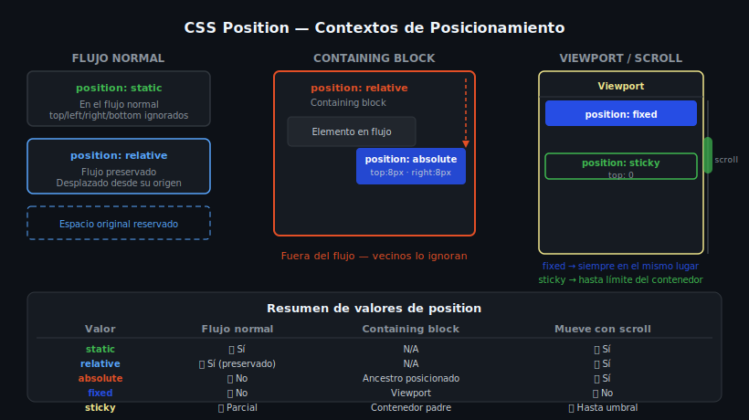

# CSS Position — Contextos de Posicionamiento



## 🎯 Objetivos

- Comprender el flujo normal del documento
- Aplicar cada valor de `position` en el contexto correcto
- Identificar el *containing block* de un elemento absoluto

---

## 📋 Contenido

### 1. El flujo normal del documento

Por defecto, los elementos siguen el **flujo normal** del documento:

- Los elementos **block** se apilan de arriba hacia abajo
- Los elementos **inline** fluyen de izquierda a derecha dentro de una línea

Cuando usamos `position`, podemos **sacar** un elemento de ese flujo o modificar su posición sin afectar a sus vecinos.

```css
/* Todos los elementos comienzan con: */
.element {
  position: static; /* valor por defecto — en el flujo normal */
}
```

---

### 2. `position: relative`

El elemento permanece en el flujo normal, pero podemos desplazarlo con `top`, `right`, `bottom`, `left` **desde su posición original**. El espacio original se mantiene.

```css
.card {
  position: relative;
  /* Se desplaza 10px hacia abajo y 5px hacia la derecha */
  /* pero su espacio original en el flujo se conserva */
  top: 10px;
  left: 5px;
}
```

> 💡 **Uso más común de `relative`:** establecer un *containing block* para elementos `absolute` hijo.

---

### 3. `position: absolute`

El elemento se **saca del flujo normal** — sus vecinos actúan como si no existiera. Se posiciona respecto a su **containing block**: el ancestro posicionado más cercano (con `position != static`). Si no hay ninguno, se posiciona respecto al viewport inicial.

```css
/* El padre debe ser el containing block */
.product-card {
  position: relative; /* ← containing block */
}

/* El badge se posiciona respecto a .product-card */
.badge {
  position: absolute;
  top: 0.75rem;
  left: 0.75rem;
}
```

```html
<!-- Ejemplo: badge sobre imagen de tarjeta -->
<article class="product-card">
  <div class="product-image-wrapper">
    
    <span class="badge">Nuevo</span>  <!-- ← absolute dentro de relative -->
  </div>
</article>
```

---

### 4. `position: fixed`

El elemento se posiciona respecto al **viewport** (la ventana del navegador). No se mueve al hacer scroll — es perfecto para headers, banners de cookie y botones flotantes.

```css
.site-header {
  position: fixed;
  top: 0;
  left: 0;
  width: 100%;
  z-index: 100; /* para quedar encima del resto */
}

/* ⚠️ Recordar: fixed saca el elemento del flujo.
   El body necesita padding-top para no quedar tapado. */
body {
  padding-top: 60px; /* altura del header fijo */
}
```

---

### 5. `position: sticky`

Combina `relative` y `fixed`. El elemento **sigue el flujo normal** hasta que llega al umbral definido (`top`, `left`, etc.), momento en que se "pega" en esa posición mientras su contenedor sea visible.

```css
.site-header {
  position: sticky;
  top: 0; /* se pega en la parte superior del viewport al hacer scroll */
  z-index: 100;
}

/* A diferencia de fixed:
   - No requiere padding en el body
   - Deja de pegarse cuando el contenedor padre sale del viewport
   - Ideal para headers, barras de navegación secundarias y columnas laterales */
```

---

### 6. Referencia rápida

| Valor | Flujo normal | Containing block | Se mueve con scroll |
|-------|-------------|-----------------|-------------------|
| `static` | ✅ Sí | N/A | ✅ Sí |
| `relative` | ✅ Sí (espacio preservado) | N/A | ✅ Sí |
| `absolute` | ❌ No | Ancestro posicionado más cercano | ✅ Sí |
| `fixed` | ❌ No | Viewport | ❌ No |
| `sticky` | ✅ Sí (hasta el umbral) | Contenedor padre | Parcial |

---

### 7. El Containing Block

El *containing block* determina dónde se posiciona un `absolute`. Para encontrarlo:

1. Sube por el árbol DOM
2. Busca el primer ancestro con `position: relative`, `absolute`, `fixed` o `sticky`
3. Si no hay ninguno → el *containing block* es el elemento `<html>`

```html
<!-- ¿Dónde se posicionará .tooltip? -->
<div class="A">                    <!-- position: static ← NO -->
  <div class="B">                  <!-- position: relative ← ✅ ESTE -->
    <div class="C">                <!-- position: static ← NO -->
      <span class="tooltip">…</span>  <!-- position: absolute -->
    </div>
  </div>
</div>
```

```css
.B { position: relative; }    /* containing block del tooltip */
.tooltip { position: absolute; top: 0; right: 0; }
```

---

## 📚 Recursos adicionales

- [MDN — position](https://developer.mozilla.org/es/docs/Web/CSS/position)
- [MDN — Containing block](https://developer.mozilla.org/es/docs/Web/CSS/Containing_block)
- [web.dev — Learn CSS: Layout](https://web.dev/learn/css/layout/)

---

## ✅ Checklist de verificación

- [ ] Puedo posicionar un badge con `absolute` sin que afecte a elementos vecinos
- [ ] Sé cuál es el *containing block* de cualquier elemento absoluto
- [ ] Entiendo la diferencia entre `fixed` (viewport) y `sticky` (umbral de scroll)
- [ ] Puedo crear un header sticky sin necesitar `padding-top` en el body
