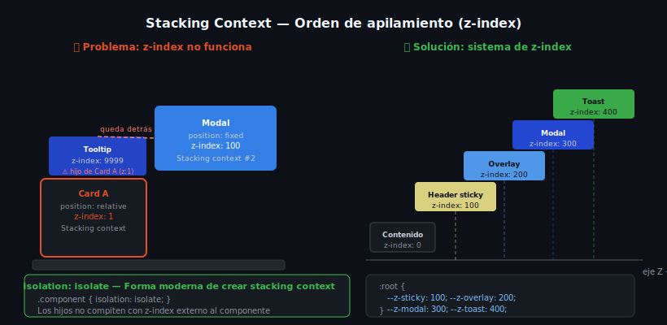

# Z-index y Stacking Context



## 🎯 Objetivos

- Controlar el orden de apilamiento visual con `z-index`
- Entender qué es un *stacking context* y cuándo se crea
- Depurar problemas de `z-index` que "no funcionan"

---

## 📋 Contenido

### 1. ¿Qué es `z-index`?

`z-index` controla el **orden en el eje Z** (profundidad) de los elementos posicionados. Un valor mayor queda encima de un valor menor.

```css
.modal-overlay {
  position: fixed;
  z-index: 200;   /* encima del header */
}

.site-header {
  position: sticky;
  z-index: 100;   /* encima del contenido normal */
}

.site-content {
  /* position: static → z-index no tiene efecto */
  z-index: 9999;  /* ← este valor es ignorado */
}
```

> ⚠️ **Regla fundamental:** `z-index` **solo funciona** en elementos con `position != static` (es decir, `relative`, `absolute`, `fixed` o `sticky`).

---

### 2. El Stacking Context (contexto de apilamiento)

Un *stacking context* es una **jerarquía visual independiente**. Los `z-index` dentro de un contexto solo compiten entre sí — no contra elementos de otros contextos.

Imagina una hoja de papel: todo lo dibujado en ella tiene su propio eje Z, pero toda la hoja tiene un único z-index respecto al resto del mundo.

**¿Cuándo se crea un nuevo stacking context?**

```css
/* 1. position != static + z-index != auto */
.header { position: sticky; z-index: 10; }

/* 2. opacity < 1 */
.overlay { opacity: 0.8; }

/* 3. transform distinto de none */
.card { transform: translateY(0); }

/* 4. filter distinto de none */
.blurred { filter: blur(4px); }

/* 5. isolation: isolate (forma explícita y recomendada) */
.isolated-component { isolation: isolate; }
```

---

### 3. Cómo depurar problemas de `z-index`

**Problema típico:** aplico `z-index: 9999` pero el elemento sigue quedando detrás de otro.

```html
<!-- ❌ No funciona como se espera -->
<div class="card" style="position: relative; z-index: 1;">
  <div class="tooltip" style="position: absolute; z-index: 9999;">
    Tooltip
  </div>
</div>

<div class="modal" style="position: fixed; z-index: 100;">
  Modal
</div>
```

El tooltip (z-index:9999) nunca quedará sobre el modal (z-index:100) porque **pertenece al stacking context del card (z-index:1)**. El card completo tiene z-index:1, menor que el modal con z-index:100.

**Solución:** asegurarse de que el elemento padre del tooltip tenga un `z-index` mayor que el modal, o mover el tooltip fuera del card.

---

### 4. Buenas prácticas con `z-index`

```css
/* ✅ Sistema de z-index organizado con variables */
:root {
  --z-base: 0;
  --z-raised: 10;
  --z-dropdown: 50;
  --z-sticky: 100;
  --z-overlay: 200;
  --z-modal: 300;
  --z-toast: 400;
}

.site-header {
  position: sticky;
  z-index: var(--z-sticky);
}

.modal-overlay {
  position: fixed;
  z-index: var(--z-overlay);
}

.modal-dialog {
  position: fixed;
  z-index: var(--z-modal);
}
```

---

### 5. `isolation: isolate`

La forma moderna y explícita de crear un stacking context sin necesitar `z-index`:

```css
/* Crea un stacking context sin valores numéricos */
.component {
  isolation: isolate;
}

/* Útil para: evitar que los hijos compitan con z-index del exterior */
/* Ideal para componentes reutilizables en Design Systems */
```

---

## 📚 Recursos adicionales

- [MDN — z-index](https://developer.mozilla.org/es/docs/Web/CSS/z-index)
- [MDN — Stacking context](https://developer.mozilla.org/es/docs/Web/CSS/CSS_positioned_layout/Understanding_z-index/Stacking_context)
- [MDN — isolation](https://developer.mozilla.org/es/docs/Web/CSS/isolation)

---

## ✅ Checklist de verificación

- [ ] Sé que `z-index` requiere `position != static`
- [ ] Entiendo qué crea un nuevo stacking context
- [ ] Puedo depurar un `z-index` que "no funciona" identificando el contexto padre
- [ ] Uso variables CSS para organizar los valores de `z-index`
