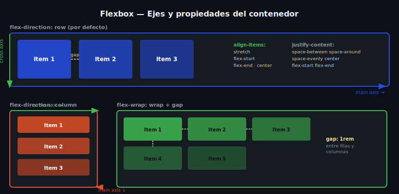

# Flex Container — Propiedades del Contenedor



## 🎯 Objetivos

- Activar Flexbox con `display: flex`
- Comprender los ejes principal y cruzado
- Controlar distribución y alineación con propiedades del contenedor

---

## 📋 Contenido

### 1. `display: flex` — Activar el flexbox

Al aplicar `display: flex` en un elemento, sus **hijos directos** se convierten en *flex items*. El contenedor recibe los ejes:

```css
.nav {
  display: flex;
  /* Los hijos directos ahora son flex items */
}
```

```html
<nav class="nav">
  <a>Inicio</a>     ← flex item
  <a>Servicios</a>  ← flex item
  <a>Contacto</a>   ← flex item
</nav>
```

> ⚠️ Solo los **hijos directos** son flex items. Los nietos no lo son a menos que también tengan `display: flex`.

---

### 2. Los ejes de Flexbox

Flexbox trabaja con **dos ejes perpendiculares**:

- **Eje principal (main axis):** dirección en que fluyen los items. Por defecto: horizontal (de izquierda a derecha).
- **Eje cruzado (cross axis):** perpendicular al eje principal. Por defecto: vertical.

```
display: flex (por defecto — flex-direction: row)

Main axis →  [Item A] [Item B] [Item C]
                 ↕ Cross axis
```

---

### 3. `flex-direction` — Cambiar el eje principal

```css
.container {
  display: flex;

  /* Valores: */
  flex-direction: row;            /* ← por defecto: izquierda a derecha */
  flex-direction: row-reverse;    /* ← derecha a izquierda */
  flex-direction: column;         /* ↓ arriba a abajo (main axis = vertical) */
  flex-direction: column-reverse; /* ↑ abajo a arriba */
}
```

> 💡 Cuando cambias a `column`, `justify-content` pasa a controlar el eje vertical y `align-items` el horizontal.

---

### 4. `justify-content` — Distribución en el eje principal

```css
.container {
  display: flex;

  justify-content: flex-start;     /* ← agrupa al inicio (por defecto) */
  justify-content: flex-end;       /* → agrupa al final */
  justify-content: center;         /* centro */
  justify-content: space-between;  /* primer y último en extremos, resto equidistantes */
  justify-content: space-around;   /* espacio igual alrededor de cada item */
  justify-content: space-evenly;   /* espacio exactamente igual entre todos */
}
```

---

### 5. `align-items` — Alineación en el eje cruzado

```css
.container {
  display: flex;
  height: 200px; /* necesita altura para ver el efecto */

  align-items: stretch;     /* ← estira los items (por defecto) */
  align-items: flex-start;  /* arriba del eje cruzado */
  align-items: flex-end;    /* abajo del eje cruzado */
  align-items: center;      /* centro del eje cruzado */
  align-items: baseline;    /* alinea por la línea base del texto */
}
```

---

### 6. `flex-wrap` — Envolver items en múltiples líneas

Por defecto, todos los items caben en una sola línea aunque desborden. `flex-wrap: wrap` permite que pasen a la siguiente línea:

```css
.cards-grid {
  display: flex;
  flex-wrap: wrap;  /* los items se envuelven si no caben */
  gap: 1rem;
}

.card {
  flex: 1 1 250px; /* no menos de 250px de ancho */
}
```

---

### 7. `gap` — Espacio entre items

```css
.container {
  display: flex;
  gap: 1rem;          /* mismo gap horizontal y vertical */
  gap: 1rem 2rem;     /* row-gap column-gap */
  row-gap: 1rem;
  column-gap: 2rem;
}

/* ✅ Usar gap en lugar de margin en flex containers */
/* gap no agrega espacio en los bordes externos del contenedor */
```

---

## 📚 Recursos adicionales

- [MDN — Flexbox](https://developer.mozilla.org/es/docs/Learn/CSS/CSS_layout/Flexbox)
- [CSS-Tricks — A Complete Guide to Flexbox](https://css-tricks.com/snippets/css/a-guide-to-flexbox/)
- [Flexbox Froggy](https://flexboxfroggy.com/#es) — juego interactivo para practicar

---

## ✅ Checklist de verificación

- [ ] Sé cuál es el eje principal y el cruzado por defecto
- [ ] Entiendo cómo cambia el comportamiento al usar `flex-direction: column`
- [ ] Uso `justify-content: space-between` para separar el logo y los links
- [ ] Uso `align-items: center` para centrar verticalmente en una navbar
- [ ] Uso `gap` en lugar de márgenes para espaciar flex items
