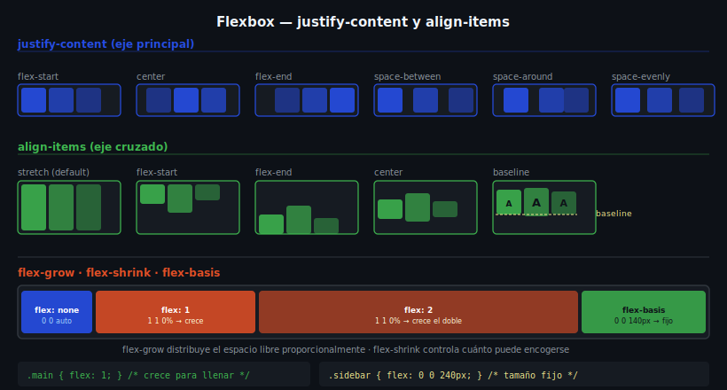

# Flex Items — Propiedades de los Elementos Hijos



## 🎯 Objetivos

- Controlar cuánto espacio ocupa cada flex item
- Usar `flex-grow`, `flex-shrink` y `flex-basis` individualmente y en shorthand
- Reordenar y alinear items de forma independiente

---

## 📋 Contenido

### 1. `flex-grow` — Cuánto crece un item

Define cuánto **espacio libre adicional** puede tomar el item. El valor es un factor multiplicador.

```css
.container {
  display: flex;
  gap: 1rem;
}

.sidebar  { flex-grow: 0; width: 240px; }  /* no crece — tamaño fijo */
.main     { flex-grow: 1; }  /* ocupa todo el espacio libre */

/* Si sidebar tiene flex-grow:1 y main tiene flex-grow:2,
   main recibe el doble de espacio libre que sidebar */
```

---

### 2. `flex-shrink` — Cuánto se encoge

Controla cuánto puede **reducirse** el item cuando no hay suficiente espacio. Por defecto es `1` (sí puede encogerse). Valor `0` = no encogerse.

```css
.logo-image {
  flex-shrink: 0;  /* no se reduce aunque no quepa */
  width: 120px;
}
```

---

### 3. `flex-basis` — Tamaño base del item

Define el **tamaño inicial** del item en el eje principal antes de distribuir el espacio libre.

```css
.card {
  flex-basis: 250px;  /* tamaño base: 250px */
  /* equivalente conceptual a width cuando flex-direction: row */
}

/* auto = usa width o height del elemento si existen */
.item { flex-basis: auto; }

/* 0% = el item no tiene tamaño inicial — todo depende de flex-grow */
.item { flex-basis: 0%; }
```

---

### 4. Shorthand `flex`

La forma más usada — combina los tres valores:

```css
/* flex: grow shrink basis */
.item { flex: 1 1 0%; }  /* reparte espacio igualmente */
.item { flex: 0 0 240px; } /* tamaño fijo de 240px */

/* Valores abreviados comunes: */
.item { flex: 1; }       /* ≡ flex: 1 1 0% — crece y encoge igual */
.item { flex: auto; }    /* ≡ flex: 1 1 auto — crece según su contenido */
.item { flex: none; }    /* ≡ flex: 0 0 auto — no crece ni encoge */

/* Patrón clásico para cards responsivas: */
.card { flex: 1 1 250px; } /* base 250px, puede crecer y encogerse */
```

---

### 5. `align-self` — Alineación individual

Sobreescribe `align-items` del contenedor para un item específico:

```css
.container {
  display: flex;
  align-items: center;  /* todos centrados en eje cruzado */
}

.item-especial {
  align-self: flex-end;  /* este item va al final del eje cruzado */
  /* otros valores: flex-start, center, stretch, baseline */
}
```

---

### 6. `order` — Reordenar visualmente

Cambia el orden visual de los items sin modificar el HTML. Por defecto todos tienen `order: 0`.

```css
/* Mostrar el sidebar después del main en pantalla
   pero antes en el HTML (mejor para accesibilidad y SEO) */
.main    { order: 1; }  /* aparece primero */
.sidebar { order: 2; }  /* aparece segundo */

/* ⚠️ Cambia solo el orden visual, no el orden del DOM.
   Los lectores de pantalla siguen el orden del HTML. */
```

---

### 7. `align-content` — Múltiples líneas (flex-wrap)

Solo aplica cuando hay múltiples líneas (`flex-wrap: wrap`). Alinea las **líneas** en el eje cruzado:

```css
.grid {
  display: flex;
  flex-wrap: wrap;
  align-content: center;       /* líneas agrupadas al centro */
  align-content: space-between; /* primera arriba, última abajo */
  align-content: flex-start;    /* líneas compactas arriba */
}
```

---

## 📚 Recursos adicionales

- [MDN — flex](https://developer.mozilla.org/es/docs/Web/CSS/flex)
- [MDN — flex-grow](https://developer.mozilla.org/es/docs/Web/CSS/flex-grow)
- [MDN — order](https://developer.mozilla.org/es/docs/Web/CSS/order)
- [Flexbox Zombies](https://mastery.games/flexboxzombies/) — juego avanzado (gratuito)

---

## ✅ Checklist de verificación

- [ ] Uso `flex-grow: 1` en el `<main>` para que ocupe el espacio restante
- [ ] Uso `flex-shrink: 0` en elementos de tamaño fijo (logo, sidebar fijo)
- [ ] Comprendo que `flex: 1` es shorthand de `flex: 1 1 0%`
- [ ] Puedo usar `align-self` para mover un item sin afectar a los demás
- [ ] Conozco que `order` cambia solo el orden visual, no el del DOM
