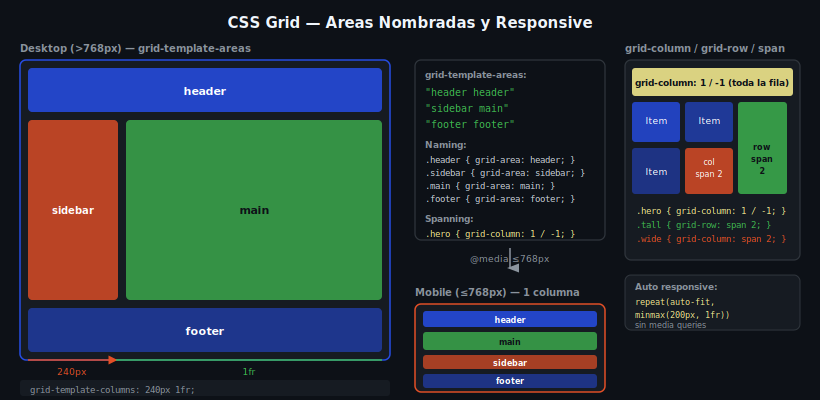

# CSS Grid — Áreas Nombradas y Posicionamiento

Con `grid-template-areas` puedes diseñar el layout de la página de forma visual y declarativa. Es como dibujar el wireframe directamente en CSS.



---

## 🎯 Objetivos

- Usar `grid-template-areas` para definir el layout
- Asignar items a áreas con `grid-area`
- Posicionar items con `grid-column` y `grid-row`
- Hacer que un item ocupe varias celdas con `span`
- Cambiar el layout en responsive sin mover el HTML

---

## 1. grid-template-areas

Dibuja el layout usando nombres. Cada cadena de texto representa una fila; los nombres dentro representan celdas. Un `.` significa celda vacía.

```css
.page-layout {
  display: grid;
  grid-template-columns: 240px 1fr;
  grid-template-rows: 60px 1fr 50px;
  grid-template-areas:
    "header  header"
    "sidebar main"
    "footer  footer";
  min-height: 100vh;
}
```

Asignación de cada elemento hijo:

```css
.site-header { grid-area: header; }
.sidebar     { grid-area: sidebar; }
.main        { grid-area: main; }
.site-footer { grid-area: footer; }
```

> 📌 El nombre en `grid-area` debe coincidir exactamente con el nombre en `grid-template-areas`.

---

## 2. Reglas de grid-template-areas

```css
/* ✅ VÁLIDO: todas las áreas forman rectángulos */
grid-template-areas:
  "header  header  header"
  "sidebar main    main"
  "footer  footer  footer";

/* ❌ INVÁLIDO: el área "main" no es un rectángulo */
grid-template-areas:
  "header  main"
  "sidebar header"; /* header aparece en dos filas no contiguas */
```

Reglas:
1. Cada área debe ser un **rectángulo perfecto** (no puede ser en L o fraccionada)
2. Una celda vacía se representa con `.`
3. Los nombres no pueden contener espacios

---

## 3. grid-column y grid-row (posicionamiento con líneas)

Las **líneas de grid** se numeran desde 1. `grid-column: 1 / 3` significa "desde la línea 1 hasta la línea 3".

```css
/* En un grid de 3 columnas, las líneas son: 1 | 2 | 3 | 4 */

.item-wide {
  grid-column: 1 / 3;  /* ocupa de la línea 1 a la 3 (2 columnas) */
  grid-row: 1 / 2;     /* ocupa de la línea 1 a la 2 (1 fila) */
}

.item-tall {
  grid-column: 3 / 4;  /* tercera columna */
  grid-row: 1 / 3;     /* ocupa 2 filas */
}
```

---

## 4. span — ocupar múltiples celdas

`span N` es una forma más legible de decir "ocupa N celdas desde la posición actual".

```css
/* Equivalentes: */
.featured { grid-column: 1 / 3; }          /* línea 1 a línea 3 */
.featured { grid-column: span 2; }         /* ocupa 2 columnas */

.tall-card { grid-row: span 2; }           /* ocupa 2 filas */
.hero      { grid-column: 1 / -1; }        /* de primera a última línea (todas las columnas) */
```

> `-1` es un shortcut para "la última línea del grid". `1 / -1` ocupa toda la fila.

---

## 5. Posicionamiento implícito vs explícito

```css
.grid {
  display: grid;
  grid-template-columns: repeat(3, 1fr);
  gap: 1rem;
}

/* Sin posición → colocación automática (implícita) */
.card { /* se coloca donde toque */ }

/* Con posición → colocación explícita */
.featured {
  grid-column: 1 / -1; /* siempre en la primera fila, todas las columnas */
}
```

---

## 6. Responsive con grid-template-areas

El poder de `grid-template-areas` brilla en responsive: cambiamos el layout sin modificar el HTML.

```css
/* Layout desktop (2 columnas) */
.page {
  display: grid;
  grid-template-columns: 240px 1fr;
  grid-template-areas:
    "header  header"
    "sidebar main"
    "footer  footer";
}

/* Layout mobile (1 columna) */
@media (max-width: 768px) {
  .page {
    grid-template-columns: 1fr;
    grid-template-areas:
      "header"
      "main"
      "sidebar"
      "footer";
  }
}
```

El sidebar aparece debajo del main en móvil sin tocar el HTML.

---

## 📚 Recursos Adicionales

- [MDN — grid-template-areas](https://developer.mozilla.org/es/docs/Web/CSS/grid-template-areas)
- [CSS-Tricks — Named Template Areas](https://css-tricks.com/snippets/css/complete-guide-grid/#named-lines)

---

## ✅ Checklist

- [ ] `grid-template-areas` dibuja el layout del contenedor
- [ ] Cada hijo tiene `grid-area` con el nombre correcto
- [ ] `grid-column: span 2` hace que un item ocupe dos columnas
- [ ] `grid-column: 1 / -1` abarca todas las columnas
- [ ] El layout cambia en mobile con `@media` sin mover el HTML
