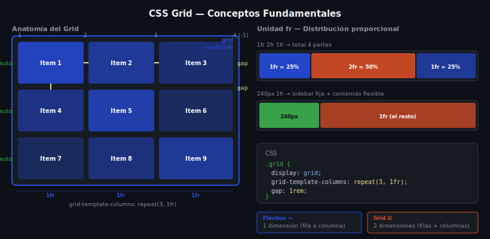

# Ejercicio 01 — Grid Container

Aprende a activar CSS Grid, definir columnas con `fr`, controlar filas y añadir espacio con `gap`.



---

## 🎯 Objetivos

- Activar `display: grid`
- Definir columnas con `grid-template-columns` y la unidad `fr`
- Controlar filas con `grid-template-rows`
- Añadir espacio con `gap`
- Controlar filas implícitas con `grid-auto-rows`

---

## Paso 1: Activar display grid

Sin Grid, los elementos `<div>` son bloques apilados. `display: grid` activa el contexto de cuadrícula.

```css
.grid-basic {
  display: grid;
  /* Por defecto: una columna, filas automáticas */
}
```

**Abre `starter/css/styles.css`** y descomenta la sección **PASO 1**.

---

## Paso 2: Columnas con fr

La unidad `fr` distribuye el espacio disponible proporcionalmente.

```css
.grid-cols {
  display: grid;
  grid-template-columns: 1fr 1fr 1fr;
  /* equivale a: repeat(3, 1fr) */
  gap: 1rem;
}
```

**Descomenta** la sección **PASO 2**.

---

## Paso 3: Columnas mixtas (fija + flexible)

```css
.grid-mixed {
  display: grid;
  grid-template-columns: 200px 1fr 2fr;
  /* primera fija, segunda 1/3 del resto, tercera 2/3 */
  gap: 1rem;
}
```

**Descomenta** la sección **PASO 3**.

---

## Paso 4: Controlar filas + grid-auto-rows

```css
.grid-rows {
  display: grid;
  grid-template-columns: repeat(3, 1fr);
  grid-auto-rows: 120px; /* todas las filas implícitas = 120px */
  gap: 1rem;
}

/* O con minmax para que se adapten al contenido */
.grid-auto {
  grid-auto-rows: minmax(100px, auto);
}
```

**Descomenta** la sección **PASO 4**.

---

## ✅ Verificación

- [ ] `display: grid` activa la cuadrícula
- [ ] `repeat(3, 1fr)` crea 3 columnas de igual ancho
- [ ] `200px 1fr 2fr` crea columna fija + 2 flexibles proporcionales
- [ ] `gap` añade espacio entre celdas (no en bordes)
- [ ] `grid-auto-rows` controla la altura de filas automáticas
