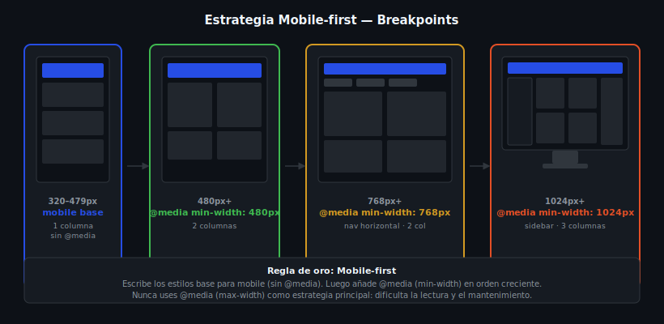

# Mobile-first y Breakpoints

> Semana 09 · Teoría 01



---

## 🎯 Objetivos

- Entender qué es Mobile-first y por qué es la estrategia estándar
- Escribir CSS base para móvil y escalar hacia pantallas mayores
- Definir breakpoints semánticos basados en el contenido

---

## 1. ¿Qué es Mobile-first?

**Mobile-first** significa escribir los estilos base pensando en la pantalla más pequeña (móvil) y luego agregar estilos para pantallas más grandes usando `@media (min-width)`.

### ¿Por qué Mobile-first?

1. **Rendimiento:** Los móviles descargan solo los estilos base. Los estilos de desktop se cargan encima, no al revés.
2. **Simplicidad:** Es más fácil agregar complejidad que quitarla. Un layout de 1 columna es el punto de partida natural.
3. **Prioridad:** Obliga a pensar primero en el contenido esencial, sin distracciones visuales complejas.
4. **Estadísticas:** Más del 60% del tráfico web global viene de móviles.

### Mobile-first vs Desktop-first

```css
/* ❌ Desktop-first — empieza con desktop y resta para mobile */
.grid {
  display: grid;
  grid-template-columns: repeat(3, 1fr); /* desktop por defecto */
}

@media (max-width: 768px) { /* "rompe" el layout para tablet */
  .grid { grid-template-columns: repeat(2, 1fr); }
}

@media (max-width: 480px) { /* "rompe" para mobile */
  .grid { grid-template-columns: 1fr; }
}
```

```css
/* ✅ Mobile-first — empieza con mobile y añade para desktop */
.grid {
  display: grid;
  grid-template-columns: 1fr; /* mobile por defecto */
}

@media (min-width: 480px) { /* tablet pequeña */
  .grid { grid-template-columns: repeat(2, 1fr); }
}

@media (min-width: 1024px) { /* desktop */
  .grid { grid-template-columns: repeat(3, 1fr); }
}
```

---

## 2. Sintaxis de `@media`

```css
/* Estructura básica */
@media (condición) {
  /* reglas que aplican cuando la condición es verdadera */
}

/* Más común: min-width */
@media (min-width: 768px) {
  .container { max-width: 960px; }
}

/* Combinando condiciones con and */
@media (min-width: 768px) and (max-width: 1023px) {
  /* solo tablet */
}

/* Orientación */
@media (orientation: landscape) {
  /* pantalla horizontal */
}

/* Preferencia del sistema operativo */
@media (prefers-color-scheme: dark) {
  /* modo oscuro */
}
```

---

## 3. Breakpoints semánticos

Los breakpoints **no deben basarse en dispositivos específicos** (iPhone, iPad…) porque los dispositivos cambian. Se deben basar en **dónde el contenido se "rompe"** visualmente.

Breakpoints comunes y bien fundamentados:

```css
/* ── Mobile base (320px–479px) ───────────────── */
/* Estilos por defecto, sin media query */

/* ── Tablet pequeña (480px+) ─────────────────── */
@media (min-width: 480px) {
  /* Layout empieza a abrirse */
}

/* ── Tablet (768px+) ─────────────────────────── */
@media (min-width: 768px) {
  /* 2 columnas, navegación horizontal */
}

/* ── Desktop (1024px+) ───────────────────────── */
@media (min-width: 1024px) {
  /* Layout completo de desktop */
}

/* ── Desktop grande (1280px+) ────────────────── */
@media (min-width: 1280px) {
  /* max-width del contenedor, más tipografía */
}
```

---

## 4. Patrón completo Mobile-first

```css
/* Estilos base (mobile 320px+) */
:root {
  --font-size-base: 1rem;
  --spacing-md: 1rem;
}

.site-header {
  padding: var(--spacing-md);
}

.main-nav {
  display: flex;
  flex-direction: column; /* links apilados en mobile */
  gap: 0.5rem;
}

.hero-title {
  font-size: 1.75rem;
}

.cards-grid {
  display: grid;
  grid-template-columns: 1fr;
  gap: var(--spacing-md);
}

/* Tablet (768px+) */
@media (min-width: 768px) {
  .main-nav {
    flex-direction: row; /* navegación horizontal */
    gap: 1.5rem;
  }

  .hero-title {
    font-size: 2.5rem;
  }

  .cards-grid {
    grid-template-columns: repeat(2, 1fr);
  }
}

/* Desktop (1024px+) */
@media (min-width: 1024px) {
  .hero-title {
    font-size: 3rem;
  }

  .cards-grid {
    grid-template-columns: repeat(3, 1fr);
  }
}
```

---

## 5. El `<meta>` viewport (obligatorio)

Sin esta meta etiqueta, los móviles escalan la página como si fuera desktop y las media queries no funcionan:

```html
<!-- Siempre en el <head> -->
<meta name="viewport" content="width=device-width, initial-scale=1.0">
```

- `width=device-width` — el viewport equivale al ancho físico del dispositivo
- `initial-scale=1.0` — sin zoom inicial

---

## 📚 Recursos adicionales

- [MDN — Responsive design](https://developer.mozilla.org/en-US/docs/Learn/CSS/CSS_layout/Responsive_Design)
- [MDN — Using media queries](https://developer.mozilla.org/en-US/docs/Web/CSS/CSS_media_queries/Using_media_queries)
- [web.dev — Responsive web design basics](https://web.dev/articles/responsive-web-design-basics)

---

## ✅ Checklist

- [ ] El `<meta viewport>` está presente en el `<head>`
- [ ] Los estilos base funcionan en 320px
- [ ] Los `@media` usan `min-width` (Mobile-first)
- [ ] Los breakpoints se eligieron por el contenido, no por dispositivos
