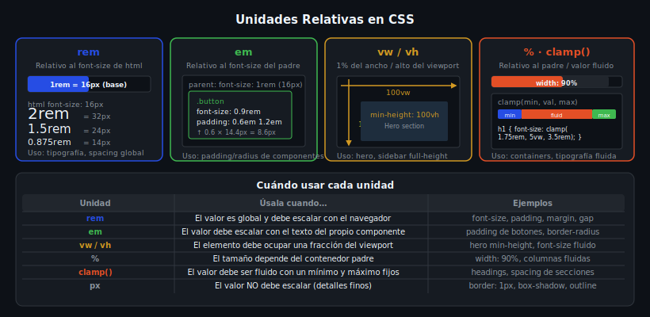

# Unidades Relativas

> Semana 09 · Teoría 02



---

## 🎯 Objetivos

- Distinguir `rem`, `em`, `vw`, `vh`, `%` y saber cuándo usar cada una
- Usar `clamp()` para crear tipografía fluida sin media queries
- Eliminar `px` fijos de tipografía y espaciados

---

## 1. `rem` — Relativo al root

`rem` (root em) es relativo al `font-size` del elemento `<html>`. Por defecto, `1rem = 16px`.

```css
/* El browser establece html { font-size: 16px } por defecto */
/* Si el usuario cambia el tamaño en su browser, rem se escala también */

:root {
  font-size: 16px; /* base del sistema (NO cambiar esto a px) */
}

h1 { font-size: 2rem; }      /* 32px */
h2 { font-size: 1.5rem; }    /* 24px */
p  { font-size: 1rem; }      /* 16px */

.section { padding: 1.5rem; } /* 24px */
```

**Usa `rem` para:** tipografía, espaciados globales (padding, margin), ancho de contenedores.

---

## 2. `em` — Relativo al padre

`em` es relativo al `font-size` del **elemento padre más cercano**.

```css
/* Útil para componentes auto-contenidos */
.button {
  font-size: 0.9rem;     /* tamaño fijo con rem */
  padding: 0.6em 1.2em;  /* padding relativo al font-size del botón */
  border-radius: 0.3em;  /* se escala con el botón */
}

/* Si cambias el font-size del botón, padding y border-radius escalan también */
.button--large { font-size: 1.1rem; }  /* todo el botón escala */
.button--small { font-size: 0.8rem; }  /* todo el botón encoge */
```

**Usa `em` para:** padding y border-radius de componentes (botones, badges, tags) que deben escalar con su font-size.

**⚠️ Cuidado:** `em` se acumula. Si el padre tiene `1.2em` y el hijo `1.2em`, el resultado es `1.44em`.

---

## 3. `vw` y `vh` — Relativo al viewport

- `1vw` = 1% del ancho (`width`) del viewport
- `1vh` = 1% del alto (`height`) del viewport
- `1vmin` = 1% del lado más pequeño
- `1vmax` = 1% del lado más grande

```css
/* El hero ocupa toda la pantalla */
.hero {
  width: 100vw;      /* ancho completo del viewport */
  min-height: 100vh; /* alto completo del viewport */
}

/* Tipografía fluida simple (no recomendada sola, usar con clamp) */
h1 { font-size: 5vw; } /* escala con el viewport pero puede ser muy pequeño/grande */
```

**Usa `vw`/`vh` para:** secciones hero de pantalla completa, modales centrados verticalmente, sidebars de altura completa.

---

## 4. `%` — Relativo al padre

`%` es relativo a la dimensión del **elemento padre** (width del padre para width y padding-horizontal; height del padre para height, pero solo si el padre tiene alto definido).

```css
.container {
  max-width: 1200px;
  width: 90%;        /* 90% del viewport en mobile, max 1200px en desktop */
  margin: 0 auto;
}

.two-col-left {
  width: 30%;        /* 30% del contenedor padre */
}

.two-col-right {
  width: 70%;        /* 70% del contenedor padre */
}

/* Truco: padding-top: 56.25% = aspect-ratio 16:9 */
.video-wrapper {
  position: relative;
  width: 100%;
  padding-top: 56.25%;
}
```

---

## 5. `clamp()` — El valor fluido

`clamp(mínimo, valor-preferido, máximo)` permite un valor que crece fluidamente entre un mínimo y un máximo.

```css
/* Tipografía que escala con el viewport sin media queries */
h1 {
  /* mínimo: 1.75rem | preferido: 5vw (fluido) | máximo: 3.5rem */
  font-size: clamp(1.75rem, 5vw, 3.5rem);
}

h2 {
  font-size: clamp(1.25rem, 3.5vw, 2.25rem);
}

p {
  font-size: clamp(0.9rem, 2vw, 1.1rem);
}

/* También para spacing */
.section {
  padding: clamp(2rem, 8vw, 6rem);
}
```

**Cómo funciona:**
- En pantallas pequeñas: el valor calculado (`5vw`) cae por debajo del mínimo → se usa `1.75rem`
- En pantallas medianas: se usa el valor fluido (`5vw`)
- En pantallas grandes: el valor calculado supera el máximo → se usa `3.5rem`

---

## 6. Resumen de cuándo usar cada unidad

| Unidad | Úsala para |
|--------|-----------|
| `rem` | Tipografía, spacing global (padding, margin), `gap` |
| `em` | Padding/border-radius de componentes que deben escalar con su texto |
| `vw` | Elementos que deben ocupar una fracción del ancho del viewport |
| `vh` | Secciones hero de pantalla completa, sidebars full-height |
| `%` | Anchos relativos al padre, fluid containers |
| `clamp()` | Tipografía fluida, spacing fluido entre un mín y un máx |
| `px` | Bordes (`border: 1px`), sombras, detalles que no deben escalar |

---

## 📚 Recursos adicionales

- [MDN — rem](https://developer.mozilla.org/en-US/docs/Web/CSS/length#rem)
- [MDN — clamp()](https://developer.mozilla.org/en-US/docs/Web/CSS/clamp)
- [web.dev — Viewport units](https://web.dev/blog/viewport-units)
- [CSS Clamp Calculator](https://www.marcbacon.com/tools/clamp-calculator/)

---

## ✅ Checklist

- [ ] Tipografía con `rem` o `clamp()` (no `px`)
- [ ] Spacing con `rem` (no `px`)
- [ ] Heroes con `min-height: 100vh`
- [ ] Bordes con `px` (excepción válida)
- [ ] `clamp()` para al menos un valor de tipografía
