# Tipografía Web — Google Fonts, @font-face y font-display

## 🎯 Objetivos

- Cargar fuentes externas con Google Fonts y `@font-face`
- Entender los valores de `font-display` y su impacto en la experiencia de usuario
- Organizar la tipografía del proyecto mediante CSS Custom Properties

---

## 1. ¿Por qué fuentes web?

Las fuentes del sistema operativo (`Arial`, `Georgia`, `Times New Roman`) son limitadas y varían entre dispositivos. Las **fuentes web** permiten usar tipografías expresivas y coherentes en todos los navegadores.

```css
/* ❌ Dependemos del SO del usuario */
body { font-family: Arial, sans-serif; }

/* ✅ Fuente web: misma tipografía en todos los dispositivos */
body { font-family: 'Inter', system-ui, sans-serif; }
```

---

## 2. Google Fonts

La forma más rápida de cargar fuentes externas. Google sirve archivos optimizados con caché en sus CDN globales.

### Método 1: `<link>` en el HTML (recomendado)

```html
<head>
  <!-- Preconnect para reducir latencia -->
  <link rel="preconnect" href="https://fonts.googleapis.com" />
  <link rel="preconnect" href="https://fonts.gstatic.com" crossorigin />

  <!-- Cargar Inter en peso 400 y 700 con font-display=swap -->
  <link
    href="https://fonts.googleapis.com/css2?family=Inter:wght@400;600;700&display=swap"
    rel="stylesheet"
  />
</head>
```

```css
/* En CSS: declara la fuente como variable */
:root {
  --font-body: 'Inter', system-ui, sans-serif;
}

body {
  font-family: var(--font-body);
}
```

### Método 2: `@import` en CSS

```css
/* Al inicio del archivo CSS */
@import url('https://fonts.googleapis.com/css2?family=Inter:wght@400;700&display=swap');
```

> ⚠️ `@import` bloquea el parseo del CSS hasta cargar la fuente. Prefiere el `<link>` con `preconnect`.

### Usando varias fuentes

```html
<!-- Una sola petición para múltiples fuentes -->
<link
  href="https://fonts.googleapis.com/css2?family=Inter:wght@400;700&family=Fira+Code:wght@400&display=swap"
  rel="stylesheet"
/>
```

```css
:root {
  --font-body: 'Inter', system-ui, sans-serif;
  --font-mono: 'Fira Code', 'Courier New', monospace;
}
```

---

## 3. @font-face — Fuentes locales

Para fuentes descargadas o self-hosted (mejor rendimiento, sin depender de Google):

```css
@font-face {
  font-family: 'Inter';
  src:
    url('../assets/fonts/inter-regular.woff2') format('woff2'),
    url('../assets/fonts/inter-regular.woff')  format('woff');
  font-weight: 400;
  font-style: normal;
  font-display: swap; /* ← SIEMPRE incluir */
}

@font-face {
  font-family: 'Inter';
  src: url('../assets/fonts/inter-bold.woff2') format('woff2');
  font-weight: 700;
  font-style: normal;
  font-display: swap;
}
```

> `woff2` es el formato moderno: compresión Brotli, compatible con todos los navegadores modernos.

---

## 4. font-display — Controlar la carga

`font-display` define el comportamiento del navegador mientras la fuente se descarga.



| Valor | Comportamiento | Recomendado para |
|---|---|---|
| `swap` | Muestra texto con fallback inmediatamente, reemplaza al cargar | La mayoría de casos (texto legible desde el inicio) |
| `block` | Texto invisible hasta 3s (FOIT), luego swap | Iconos (font icons) |
| `fallback` | Texto invisible 100ms, luego fallback, no reemplaza tras 3s | Alto rendimiento |
| `optional` | Solo usa la fuente si ya está en caché | Rendimiento máximo |
| `auto` | El navegador decide (generalmente `block`) | No recomendado |

```css
/* ✅ Texto siempre legible: swap */
@font-face {
  font-family: 'Inter';
  src: url('inter.woff2') format('woff2');
  font-display: swap;
}
```

**FOIT** (Flash of Invisible Text): texto invisible durante la carga. Lo provoca `block`.
**FOUT** (Flash of Unstyled Text): texto con fuente de fallback visible antes de la fuente web. Lo provoca `swap`.

`swap` causa FOUT pero garantiza legibilidad — es el trade-off correcto.

---

## 5. Propiedades tipográficas esenciales

```css
:root {
  /* Familias */
  --font-body: 'Inter', system-ui, sans-serif;
  --font-heading: 'Cal Sans', 'Inter', system-ui, sans-serif;
  --font-mono: 'Fira Code', 'Courier New', monospace;

  /* Pesos */
  --font-regular: 400;
  --font-semibold: 600;
  --font-bold: 700;

  /* Interlineado */
  --leading-tight: 1.2;    /* headings */
  --leading-normal: 1.6;   /* cuerpo de texto */
  --leading-loose: 1.8;    /* texto largo */

  /* Espaciado entre letras */
  --tracking-tight: -0.02em;  /* headings grandes */
  --tracking-normal: 0em;
  --tracking-wide: 0.05em;    /* labels, eyebrows */
}

h1 {
  font-family: var(--font-heading);
  font-weight: var(--font-bold);
  line-height: var(--leading-tight);
  letter-spacing: var(--tracking-tight);
}

body {
  font-family: var(--font-body);
  font-weight: var(--font-regular);
  line-height: var(--leading-normal);
}
```

---

## 6. Font stacks modernos sin Google Fonts

Alternativas del sistema que lucen bien sin cargar nada externo:

```css
:root {
  /* System UI — usa la fuente nativa del SO */
  --font-sans: system-ui, -apple-system, BlinkMacSystemFont,
               'Segoe UI', Roboto, 'Helvetica Neue', Arial, sans-serif;

  /* Monospace del sistema */
  --font-mono: ui-monospace, 'Cascadia Code', 'Source Code Pro',
               Menlo, Consolas, 'Courier New', monospace;
}
```

> Fuente del sistema en macOS = SF Pro / San Francisco; en Windows = Segoe UI; en Android = Roboto.

---

## ✅ Checklist de Verificación

- [ ] `preconnect` a `fonts.googleapis.com` y `fonts.gstatic.com` en el HTML
- [ ] `display=swap` en la URL de Google Fonts (o `font-display: swap` en `@font-face`)
- [ ] Fuente declarada como Custom Property (`--font-body`)
- [ ] Stack de fallback definido correctamente (termina en `sans-serif` o `monospace`)
- [ ] Pesos cargados solo los necesarios (no cargar todos)

## 📚 Recursos Adicionales

- MDN — @font-face: https://developer.mozilla.org/es/docs/Web/CSS/@font-face
- MDN — font-display: https://developer.mozilla.org/en-US/docs/Web/CSS/@font-face/font-display
- Google Fonts: https://fonts.google.com/
- Font Squirrel (fuentes gratuitas): https://www.fontsquirrel.com/
