# Colores y Gradientes en CSS

## 🎯 Objetivos

- Entender el modelo de color HSL y sus ventajas sobre HEX y RGB
- Crear paletas coherentes con variables CSS y HSL
- Aplicar gradientes lineales, radiales y cónicos

---

## 1. Modelos de color en CSS

CSS admite varios formatos de color:

```css
/* HEX */
color: #264de4;
color: #264de4cc; /* con opacidad (cc = 80%) */

/* RGB */
color: rgb(38, 77, 228);
color: rgb(38 77 228 / 80%); /* sintaxis moderna */

/* HSL ← RECOMENDADO para sistemas de diseño */
color: hsl(225, 73%, 52%);
color: hsl(225 73% 52% / 80%); /* con opacidad */

/* oklch ← futuro: perceptually uniform */
color: oklch(56% 0.21 266);
```

---

## 2. Modelo HSL



HSL describe el color en términos perceptuales:

| Parámetro | Rango | Descripción |
|---|---|---|
| **H** (Hue) | 0–360° | El color en sí: rojo (0°), verde (120°), azul (240°) |
| **S** (Saturation) | 0–100% | Intensidad: 0% = gris, 100% = color puro |
| **L** (Lightness) | 0–100% | Brillo: 0% = negro, 50% = normal, 100% = blanco |

```css
/* El mismo hue (225°), variando solo Lightness → escala de un mismo color */
:root {
  --blue-900: hsl(225, 73%, 15%);  /* muy oscuro */
  --blue-700: hsl(225, 73%, 35%);
  --blue-500: hsl(225, 73%, 52%);  /* base */
  --blue-300: hsl(225, 73%, 70%);
  --blue-100: hsl(225, 73%, 90%);  /* muy claro */
}
```

**Ventaja de HSL sobre HEX:** puedes crear una paleta completa cambiando solo la `L` (lightness) — manteniendo la identidad del color.

---

## 3. Paleta de colores semántica con CSS Variables

```css
:root {
  /* Primitivos — valores HSL base */
  --hue-brand: 225;
  --hue-danger: 4;
  --hue-success: 142;
  --hue-warning: 38;

  /* Semánticos — usan los primitivos */
  --color-primary:       hsl(var(--hue-brand) 73% 52%);
  --color-primary-dark:  hsl(var(--hue-brand) 73% 38%);
  --color-primary-light: hsl(var(--hue-brand) 73% 92%);

  --color-danger:        hsl(var(--hue-danger) 85% 52%);
  --color-success:       hsl(var(--hue-success) 72% 40%);
  --color-warning:       hsl(var(--hue-warning) 92% 50%);

  /* Neutros */
  --color-bg:            hsl(0 0% 100%);
  --color-surface:       hsl(220 14% 97%);
  --color-border:        hsl(215 20% 88%);
  --color-text:          hsl(215 25% 10%);
  --color-text-muted:    hsl(215 15% 45%);
}
```

> Separar los *primitivos* (hue base) de los *semánticos* permite cambiar el color de marca en un solo lugar.

---

## 4. Opacidad y transparencia

```css
/* Opacidad inline */
background: hsl(225 73% 52% / 10%); /* azul con 10% de opacidad */
border:     1px solid hsl(0 0% 0% / 15%);

/* currentColor — hereda el color del texto */
svg { fill: currentColor; }

/* transparent */
background: transparent;
```

---

## 5. Gradientes CSS

### `linear-gradient`

```css
/* Sintaxis: dirección, color-stop-1, color-stop-2 */
background: linear-gradient(135deg, #264de4, #e34f26);

/* Con ángulo + múltiples stops */
background: linear-gradient(
  180deg,
  hsl(225 73% 52%) 0%,
  hsl(225 73% 28%) 100%
);

/* Usando variables */
background: linear-gradient(
  135deg,
  var(--color-primary),
  var(--color-accent)
);
```

### `radial-gradient`

```css
/* De un punto central hacia afuera */
background: radial-gradient(
  circle at 30% 40%,
  hsl(225 73% 60%),
  hsl(225 73% 20%)
);
```

### `conic-gradient`

```css
/* Rota alrededor de un punto central — útil para charts de tarta */
background: conic-gradient(
  var(--color-primary) 0% 40%,
  var(--color-success) 40% 70%,
  var(--color-warning) 70% 100%
);
```

### Gradiente como texto

```css
.gradient-text {
  background: linear-gradient(135deg, #264de4, #e34f26);
  -webkit-background-clip: text;
  background-clip: text;
  color: transparent;
}
```

---

## 6. Texto legible sobre gradientes (accesibilidad)

WCAG AA requiere contraste mínimo 4.5:1 para texto normal. Sobre gradientes, el contraste varía: evalúa siempre en el punto de menor contraste.

```css
/* Overlay oscuro para garantizar legibilidad */
.hero {
  background: linear-gradient(
    135deg,
    hsl(225 73% 25%) 0%,
    hsl(225 73% 15%) 100%
  );
}

.hero-title {
  color: hsl(0 0% 100%); /* blanco sobre azul oscuro → contraste >10:1 */
}
```

---

## ✅ Checklist de Verificación

- [ ] Colores definidos en HSL, no en HEX ni RGB
- [ ] Paleta semántica separada de primitivos en `:root`
- [ ] Opacidad con `hsl(H S% L% / X%)` en lugar de `rgba()`
- [ ] Gradientes sin texto ilegible encima
- [ ] Contraste verificado con DevTools (o Contrast Checker)

## 📚 Recursos Adicionales

- MDN — color: https://developer.mozilla.org/es/docs/Web/CSS/color_value
- MDN — gradient: https://developer.mozilla.org/es/docs/Web/CSS/gradient
- CSS Gradient Generator: https://cssgradient.io/
- WCAG Contrast Checker: https://webaim.org/resources/contrastchecker/
