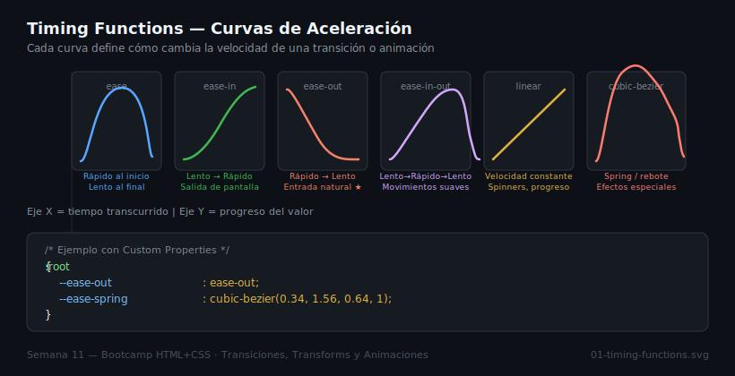

# Transitions — Transiciones CSS

## 🎯 Objetivos

- Entender el shorthand `transition` y sus 4 sub-propiedades
- Conocer las timing functions y cuándo usar cada una
- Animar solo propiedades seguras (compositor-only)
- Crear tokens de transición reutilizables

---

## 1. ¿Qué es una Transición?

Una transición interpola el valor de una propiedad CSS entre dos estados (generalmente `:hover` o `:focus`). El navegador calcula todos los fotogramas intermedios automáticamente.

```css
/* Sin transición — el cambio es instantáneo */
.btn { background: var(--color-primary); }
.btn:hover { background: var(--blue-700); }

/* Con transición — el cambio es gradual */
.btn {
  background: var(--color-primary);
  /* transition: propiedad duración función-de-tiempo retraso */
  transition: background 200ms ease-out;
}
.btn:hover { background: var(--blue-700); }
```

---

## 2. El Shorthand `transition`

```
transition: <property> <duration> <easing> <delay>
```

| Sub-propiedad | Valores comunes | Por defecto |
|---------------|----------------|-------------|
| `transition-property` | `all`, `background`, `transform`, `opacity` | `all` |
| `transition-duration` | `200ms`, `0.3s` | `0s` |
| `transition-timing-function` | `ease`, `ease-in-out`, `linear`, `cubic-bezier()` | `ease` |
| `transition-delay` | `0ms`, `100ms` | `0s` |

```css
/* Múltiples transiciones separadas por coma */
.card {
  transition:
    transform  200ms ease-out,
    box-shadow 200ms ease-out;
}

/* ❌ Evitar "all" — puede causar transiciones no deseadas */
.card { transition: all 200ms ease; }
```

---

## 3. Timing Functions

Las timing functions definen la curva de aceleración de la transición.



| Función | Comportamiento | Cuándo usarla |
|---------|---------------|---------------|
| `ease` | Rápido al inicio, lento al final | Uso general (por defecto) |
| `ease-in` | Lento → rápido | Elementos que salen de pantalla |
| `ease-out` | Rápido → lento | Elementos que entran (más natural) |
| `ease-in-out` | Lento → rápido → lento | Movimientos continuos |
| `linear` | Velocidad constante | Spinners, progreso |
| `cubic-bezier(x1,y1,x2,y2)` | Curva personalizada | Efectos especiales |

```css
/* cubic-bezier — herramienta: https://cubic-bezier.com/ */
.btn {
  transition: transform 300ms cubic-bezier(0.34, 1.56, 0.64, 1);
  /* ^^ efecto "spring" — rebota ligeramente al final */
}
```

---

## 4. Propiedades Seguras para Animar

No todas las propiedades son igual de eficientes para animar.

```css
/* ✅ Compositor-only — NO causan reflow ni repaint */
.elemento {
  transform: translateY(-4px);  /* mueve sin afectar el layout */
  opacity: 0.8;
}

/* ⚠️ Causan repaint (más costoso, pero aceptable con moderación) */
.elemento {
  background-color: var(--color-primary);
  box-shadow: var(--shadow-md);
  color: var(--color-text);
  border-color: var(--color-border);
}

/* ❌ Causan reflow — afectan el layout, costosas */
.elemento {
  width: 200px;
  height: 100px;
  top: 50px;
  margin: 20px;
}
```

---

## 5. Design Tokens para Transiciones

```css
:root {
  /* Duraciones */
  --duration-fast:   150ms;
  --duration-base:   200ms;
  --duration-slow:   350ms;

  /* Funciones de tiempo */
  --ease-out:     ease-out;
  --ease-in-out:  ease-in-out;
  --ease-spring:  cubic-bezier(0.34, 1.56, 0.64, 1);

  /* Shorthand listos para usar */
  --transition-base:      var(--duration-base) var(--ease-out);
  --transition-fast:      var(--duration-fast) var(--ease-out);
  --transition-elevation: transform var(--duration-base) var(--ease-out),
                          box-shadow var(--duration-base) var(--ease-out);
}

/* Uso */
.card {
  transition: var(--transition-elevation);
}
.card:hover {
  transform: translateY(-4px);
  box-shadow: var(--shadow-lg);
}
```

---

## 6. Accesibilidad: `prefers-reduced-motion`

Algunos usuarios son sensibles al movimiento (vestibular disorder). Siempre respeta esta preferencia:

```css
/* Reduce o elimina el movimiento cuando el usuario lo prefiere */
@media (prefers-reduced-motion: reduce) {
  *,
  *::before,
  *::after {
    animation-duration:   0.01ms !important;
    animation-iteration-count: 1 !important;
    transition-duration:  0.01ms !important;
  }
}
```

---

## ✅ Checklist

- [ ] Transiciones especifican la propiedad exacta (no `all`)
- [ ] Se usan tokens `--duration-*` y `--ease-*` en lugar de valores fijos
- [ ] Se animan preferentemente `transform` y `opacity`
- [ ] `prefers-reduced-motion` está implementado

---

## 📚 Recursos

- [MDN — transition](https://developer.mozilla.org/es/docs/Web/CSS/transition)
- [MDN — transition-timing-function](https://developer.mozilla.org/en-US/docs/Web/CSS/transition-timing-function)
- [cubic-bezier.com](https://cubic-bezier.com/) — visualizador interactivo
- [web.dev — CSS transitions](https://web.dev/learn/css/transitions)
