# Transforms — Transformaciones CSS

## 🎯 Objetivos

- Usar las funciones `transform` en 2D: translate, rotate, scale, skew
- Combinar múltiples transforms correctamente
- Controlar el punto de pivote con `transform-origin`
- Crear efectos 3D básicos con `perspective`

---

## 1. ¿Qué es `transform`?

La propiedad `transform` aplica transformaciones geométricas a un elemento **sin afectar el flujo del documento**. El espacio que ocupaba el elemento se conserva; solo su apariencia visual cambia.



```css
/* La caja se mueve visualmente pero el espacio original se mantiene */
.caja {
  transform: translateX(50px);
}
```

---

## 2. Funciones 2D

### `translate(x, y)` — mover

```css
/* mover 20px a la derecha, 10px hacia abajo */
transform: translate(20px, 10px);

/* solo eje X */
transform: translateX(20px);

/* solo eje Y (habitual en hover lift) */
transform: translateY(-4px);
```

### `rotate(ángulo)` — rotar

```css
/* rotar 45 grados en sentido horario */
transform: rotate(45deg);

/* rotar en sentido antihorario */
transform: rotate(-45deg);

/* también acepta fracciones de vuelta */
transform: rotate(0.25turn);
```

### `scale(n)` — escalar

```css
/* 1.1 = 10% más grande */
transform: scale(1.1);

/* independiente en cada eje */
transform: scale(1.2, 0.8);

/* efecto presionar botón */
transform: scale(0.95);
```

### `skew(x, y)` — inclinar

```css
/* inclinar 10 grados en eje X */
transform: skewX(10deg);

/* inclinar 10 grados en eje Y */
transform: skewY(5deg);
```

---

## 3. Combinar Funciones

Cuando se combinan varias funciones, se aplican de **derecha a izquierda**. El orden importa.

```css
/* ✅ Correcto: escala primero, luego translada */
transform: translate(-50%, -50%) scale(1.05);

/* ❌ Diferente resultado: translada primero, luego escala */
transform: scale(1.05) translate(-50%, -50%);
```

---

## 4. `transform-origin`

Define el punto de pivote de la transformación. Default: `center center` (`50% 50%`).

```css
/* Rotar desde la esquina superior izquierda */
.tarjeta {
  transform-origin: top left;
  transform: rotate(5deg);
}

/* Escalar desde abajo (útil para menús desplegables) */
.dropdown {
  transform-origin: top center;
  transform: scaleY(0);
}
.dropdown.abierto {
  transform: scaleY(1);
}
```

Valores posibles: `top left | top center | top right | center | bottom left | center center | 0 0 | 50% 50%`

---

## 5. Transforms 3D

Para 3D se necesita un **contexto de perspectiva** en el elemento padre.

```css
/* El padre establece la perspectiva */
.scene {
  perspective: 600px;
  /* Valor menor = perspectiva más pronunciada / dramática */
  /* Valor mayor = perspectiva más sutil / plana */
}

/* El hijo recibe el transform 3D */
.card {
  transform: rotateY(0deg);
  transition: transform 400ms ease-out;
}
.scene:hover .card {
  transform: rotateY(-10deg);
}
```

### Funciones 3D útiles

```css
transform: rotateX(20deg);   /* inclina hacia arriba/abajo */
transform: rotateY(30deg);   /* efecto tarjeta volteando */
transform: rotateZ(10deg);   /* igual que rotate() 2D */
transform: translateZ(20px); /* acercar/alejar del espectador */
transform: perspective(600px) rotateY(20deg); /* alternativa en línea */
```

### Preservar perspectiva en hijos

```css
.scene {
  perspective: 800px;
  transform-style: preserve-3d; /* necesario si el hijo tiene hijos 3D */
}
```

---

## 6. Caso de Uso: Card Hover Lift

```css
:root {
  --transition-elevation: transform 200ms ease-out, box-shadow 200ms ease-out;
}

.card {
  border-radius: var(--radius-md);
  box-shadow:    var(--shadow-sm);
  transition:    var(--transition-elevation);
}

.card:hover {
  transform:  translateY(-4px);
  box-shadow: var(--shadow-lg);
}
```

---

## ✅ Checklist

- [ ] Transformaciones combinadas en el orden correcto
- [ ] `transform-origin` ajustado cuando el pivote importa
- [ ] `perspective` en el elemento padre para efectos 3D
- [ ] Se usa `transform` en lugar de `top`/`left` para movimiento

---

## 📚 Recursos

- [MDN — transform](https://developer.mozilla.org/es/docs/Web/CSS/transform)
- [MDN — transform-origin](https://developer.mozilla.org/es/docs/Web/CSS/transform-origin)
- [MDN — perspective](https://developer.mozilla.org/es/docs/Web/CSS/perspective)
- [web.dev — CSS transforms](https://web.dev/learn/css/transforms)
