# Pseudo-clases de Posición

> **Semana 12 — Teoría 01**: Seleccionar elementos por su posición dentro del DOM.

---

## 🎯 Objetivos

- Distinguir `:nth-child()` de `:nth-of-type()`
- Escribir la fórmula `An+B` para seleccionar patrones repetidos
- Usar `:first-child`, `:last-child` y `:only-child` con precisión
- Entender por qué estas pseudo-clases no añaden especificidad extra

---

## 1. La Familia `:nth-child`

`:nth-child(n)` selecciona un elemento que es el **hijo número `n`** de su padre, sin importar el tipo de etiqueta.

```html
<!-- HTML de ejemplo -->
<ul class="color-list">
  <li>Rojo</li>      <!-- hijo 1 -->
  <li>Verde</li>     <!-- hijo 2 -->
  <li>Azul</li>      <!-- hijo 3 -->
  <li>Amarillo</li>  <!-- hijo 4 -->
  <li>Morado</li>    <!-- hijo 5 -->
  <li>Naranja</li>   <!-- hijo 6 -->
</ul>
```

```css
/* Seleccionar solo el tercer elemento */
.color-list li:nth-child(3) {
  font-weight: 700;
  color: var(--color-accent);
}
```

### Palabras clave: `even` y `odd`

```css
/* ✅ Zebra stripes — filas alternas */
tbody tr:nth-child(even) {
  background: hsl(220 14% 10%);
}

tbody tr:nth-child(odd) {
  background: transparent;
}
```

---

## 2. La Fórmula `An+B`

La notación `An+B` permite seleccionar grupos de elementos con un patrón matemático.

| Selector | Selecciona |
|----------|-----------|
| `:nth-child(1)` | El primero |
| `:nth-child(2n)` | 2, 4, 6, 8… (pares — equivale a `even`) |
| `:nth-child(2n+1)` | 1, 3, 5, 7… (impares — equivale a `odd`) |
| `:nth-child(3n)` | 3, 6, 9, 12… (cada tercero) |
| `:nth-child(3n+1)` | 1, 4, 7, 10… (cada tercero empezando desde 1) |
| `:nth-child(n+4)` | 4, 5, 6, 7… (del cuarto en adelante) |
| `:nth-child(-n+3)` | 1, 2, 3 (los tres primeros) |

```css
/* Grid de fotos: destacar las que están en posición 1, 4, 7… */
.photo-grid .photo:nth-child(3n+1) {
  grid-column: span 2;
  grid-row: span 2;
}

/* Solo los primeros 3 elementos de una lista de tarjetas */
.card-list .card:nth-child(-n+3) {
  border-top: 3px solid var(--color-primary);
}
```

---

## 3. `:nth-last-child()`

Funciona igual que `:nth-child()` pero contando **desde el final**.

```css
/* El penúltimo elemento */
.nav-item:nth-last-child(2) {
  margin-right: auto; /* empuja lo que sigue a la derecha */
}

/* Los dos últimos items */
li:nth-last-child(-n+2) {
  opacity: 0.6;
}
```

---

## 4. `:nth-of-type()` — Diferencia Clave

`:nth-child` cuenta **todos los hijos** del padre.
`:nth-of-type` cuenta solo los hijos del **mismo tipo de etiqueta**.

```html
<section>
  <h2>Título</h2>   <!-- h2 — hijo 1 — h2:nth-of-type(1) -->
  <p>Párrafo 1</p>  <!-- p  — hijo 2 — p:nth-of-type(1) -->
  <p>Párrafo 2</p>  <!-- p  — hijo 3 — p:nth-of-type(2) -->
  <p>Párrafo 3</p>  <!-- p  — hijo 4 — p:nth-of-type(3) -->
</section>
```

```css
/* Selecciona el segundo <p>, ignorando el <h2> */
section p:nth-of-type(2) {
  color: var(--color-primary);
}

/* Con :nth-child(2) seleccionaría el primer <p> solo si fuera */
/* el segundo hijo EN TOTAL (la h2 cuenta como hijo 1) */
section p:nth-child(2) { /* ← selecciona "Párrafo 1" */ }
```

> ⚠️ **Regla de oro:** Si el padre mezcla tipos de etiquetas, usa `:nth-of-type()`. Si todos los hijos son del mismo tipo, `:nth-child()` es más predecible.

---

## 5. Atajos: `:first-child`, `:last-child`, `:only-child`

```css
/* Quitar el margen superior del primer hijo */
.content > *:first-child { margin-top: 0; }

/* Quitar el margen inferior del último hijo */
.content > *:last-child  { margin-bottom: 0; }

/* Elemento sin hermanos: cambia su apariencia */
.card:only-child {
  max-width: 600px;
  margin-inline: auto;
}

/* Equivalentes con :first-of-type y :last-of-type */
article p:first-of-type { font-size: 1.1em; }
article p:last-of-type  { margin-bottom: 0; }
```

---

## 6. Especificidad

Las pseudo-clases estructurales tienen la misma especificidad que las clases: **(0, 1, 0)**.

```css
/* Especificidad: 0-1-1 (una pseudo-clase + un tipo) */
li:nth-child(2n) { background: red; }

/* Especificidad: 0-1-1 (igual que arriba) */
li.active        { background: blue; } /* ← ganará si viene después */
```

---

## 📊 Diagrama



---

## ✅ Checklist

- [ ] Sé escribir `:nth-child(2n+1)` y entiendo su resultado
- [ ] Conozco la diferencia entre `:nth-child` y `:nth-of-type`
- [ ] Puedo aplicar zebra stripes a una tabla con una sola regla CSS
- [ ] Uso `:first-child` y `:last-child` para eliminar márgenes redundantes
- [ ] Entiendo que estas pseudo-clases tienen especificidad (0, 1, 0)

---

## 📚 Recursos

- [MDN — :nth-child()](https://developer.mozilla.org/es/docs/Web/CSS/:nth-child)
- [MDN — :nth-of-type()](https://developer.mozilla.org/es/docs/Web/CSS/:nth-of-type)
- [CSS-Tricks — nth-child Tester](https://css-tricks.com/examples/nth-child-tester/)
