# Pseudo-elementos CSS

> **Semana 12 — Teoría 02**: Crear y controlar contenido generado con `::before` y `::after`.

---

## 🎯 Objetivos

- Entender qué son los pseudo-elementos y cómo se diferencian de las pseudo-clases
- Crear contenido decorativo con `::before` y `::after`
- Usar `position: absolute` en pseudo-elementos para decoraciones avanzadas
- Conocer otros pseudo-elementos útiles: `::marker`, `::selection`, `::placeholder`

---

## 1. ¿Qué son los Pseudo-elementos?

Los pseudo-elementos permiten **estilizar partes específicas** de un elemento o **generar contenido visual** sin modificar el HTML. Se escriben con `::` doble (CSS3) aunque algunos navegadores aceptan `:` simple (CSS2).

```css
/* ✅ Notación moderna */
p::first-line  { font-weight: bold; }
a::before      { content: "→ "; }

/* Pseudo-elementos CSS3 principales */
::before        /* antes del contenido del elemento */
::after         /* después del contenido del elemento */
::first-line    /* primera línea de un bloque de texto */
::first-letter  /* primera letra de un bloque */
::marker        /* el marcador de <li> (el punto/número) */
::selection     /* texto seleccionado por el usuario */
::placeholder   /* texto de placeholder de <input> */
```

---

## 2. `::before` y `::after`

Son pseudo-elementos que se insertan **como hijos** del elemento, antes (o después) de su contenido. La propiedad `content` es **obligatoria** — sin ella, el pseudo-elemento no se renderiza.

```css
/* Sintaxis mínima — content vacío ocupa espacio si tiene width/height */
.element::before {
  content: "";           /* obligatorio */
  display: block;        /* los pseudo-elementos son inline por defecto */
  width: 20px;
  height: 20px;
  background: var(--color-primary);
}

/* Texto como contenido */
.badge::before {
  content: "NUEVO";
  background: hsl(142 61% 38%);
  color: #fff;
  font-size: 0.7rem;
  font-weight: 700;
  padding: 0.2em 0.6em;
  border-radius: 9999px;
  margin-right: 0.5rem;
}
```

> 📐 **Modelo de caja:** `::before` y `::after` son `display: inline` por defecto. Para darles `width` o `height` debes cambiar a `display: block` o `display: inline-block`.

---

## 3. Decoraciones con `position: absolute`

El patrón más poderoso: el **elemento padre** con `position: relative`, y el pseudo-elemento con `position: absolute`.

```css
/* ── Ribbon diagonal en esquina superior derecha ── */
.card {
  position: relative;        /* contexto para el pseudo-elemento */
  overflow: hidden;          /* oculta lo que sale de la tarjeta */
}

.card.featured::before {
  content: "DESTACADO";
  position: absolute;
  top: 18px;
  right: -28px;
  width: 120px;
  background: hsl(45 96% 55%);    /* amarillo */
  color: #000;
  font-size: 0.65rem;
  font-weight: 700;
  text-align: center;
  padding: 4px 0;
  transform: rotate(45deg);
  z-index: 1;
}
```

```css
/* ── Línea decorativa antes de un heading ── */
.section-title {
  position: relative;
  padding-left: 1.25rem;
}

.section-title::before {
  content: "";
  position: absolute;
  left: 0;
  top: 0;
  bottom: 0;
  width: 4px;
  background: var(--color-primary);
  border-radius: 2px;
}
```

---

## 4. Leer Atributos con `attr()`

La función `attr()` permite usar el valor de un atributo HTML como contenido del pseudo-elemento.

```html
<!-- HTML con atributo de datos -->
<button data-tooltip="Eliminar este registro" class="btn-danger">
  🗑
</button>
```

```css
/* CSS — el tooltip lee el atributo automáticamente */
[data-tooltip] {
  position: relative;
}

[data-tooltip]::after {
  /* attr() inyecta el valor del atributo como texto */
  content: attr(data-tooltip);
  position: absolute;
  bottom: calc(100% + 8px);
  left: 50%;
  transform: translateX(-50%);
  background: hsl(220 14% 10%);
  color: #fff;
  font-size: 0.75rem;
  padding: 0.4em 0.8em;
  border-radius: 4px;
  white-space: nowrap;
  /* Oculto por defecto */
  opacity: 0;
  visibility: hidden;
  transition: opacity 150ms ease-out, visibility 150ms ease-out;
}

[data-tooltip]:hover::after,
[data-tooltip]:focus::after {
  opacity: 1;
  visibility: visible;
}
```

> ⚠️ **Accesibilidad:** `::after` con `content: attr(data-tooltip)` no es legible por lectores de pantalla. Siempre complementa con `aria-label` o `title` en el elemento HTML.

---

## 5. `::marker` — Personas Marcadores de Lista

```css
/* Estilizar el bullet de <li> sin modificar el HTML */
li::marker {
  color: var(--color-primary);
  font-size: 1.2em;
}

/* Con un carácter personalizado */
.checklist li::marker {
  content: "✓ ";
  color: hsl(142 61% 38%);
  font-weight: 700;
}
```

> 📌 Solo admite `color`, `content`, `font-*`, y algunas otras propiedades. No acepta `position`.

---

## 6. `::selection` y `::placeholder`

```css
/* Texto seleccionado por el usuario */
::selection {
  background: hsl(225 73% 52%);
  color: #fff;
}

/* Texto de guía en inputs */
input::placeholder {
  color: hsl(220 10% 50%);
  font-style: italic;
}

input:focus::placeholder {
  opacity: 0.5; /* desvanece el placeholder al escribir */
}
```

---

## 📊 Diagrama



---

## ✅ Checklist

- [ ] Siempre incluyo `content: ""` (o un valor) en `::before`/`::after`
- [ ] Cuando uso `position: absolute` en un pseudo-elemento, el padre tiene `position: relative`
- [ ] Uso `attr()` para leer datos del HTML en lugar de duplicar texto
- [ ] Aplico `overflow: hidden` al padre cuando el pseudo-elemento debe recortarse
- [ ] Agrego estilos `:focus` además de `:hover` para accesibilidad

---

## 📚 Recursos

- [MDN — ::before](https://developer.mozilla.org/es/docs/Web/CSS/::before)
- [MDN — ::after](https://developer.mozilla.org/es/docs/Web/CSS/::after)
- [MDN — ::marker](https://developer.mozilla.org/es/docs/Web/CSS/::marker)
- [CSS-Tricks — A Whole Bunch of Amazing Stuff Pseudo Elements Can Do](https://css-tricks.com/pseudo-element-roundup/)
