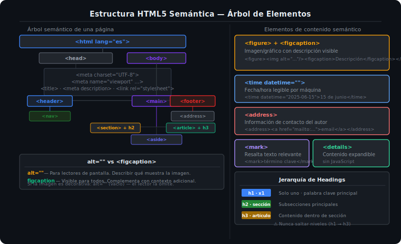

# Ejercicio 01 — De Div Soup a HTML Semántico

> Semana 13 · Práctica 01

## 🎯 Objetivo

Transformar un documento HTML escrito con `<div>` genéricos ("div soup") en HTML5 semántico correcto, aplicando landmarks, jerarquía de headings y elementos de contenido semántico.

---

## 🧠 Antes de empezar

Lee [01-semantica-html5.md](../../1-teoria/01-semantica-html5.md) y consulta el diagrama:



---

## 📂 Archivos

Trabaja en: `starter/index.html`

---

## Paso 1: Reemplaza los landmarks (div principales)

El documento tiene estos `<div>` en la estructura principal:

```html
<div class="header">...</div>
<div class="nav">...</div>
<div class="main">...</div>
<div class="sidebar">...</div>
<div class="footer">...</div>
```

**Descomenta la sección PASO 1** en `starter/index.html` para ver cómo quedaría la estructura semántica correcta y verifica en el navegador.

Reglas:
- `<div class="header">` → `<header>`
- `<div class="nav">` → `<nav aria-label="Navegación principal">`
- `<div class="main">` → `<main id="main-content">`
- `<div class="sidebar">` → `<aside aria-label="Contenido relacionado">`
- `<div class="footer">` → `<footer>`

---

## Paso 2: Corrige la jerarquía de headings

El documento actual tiene esta jerarquía **incorrecta**:

```html
<h1>Blog de Frontend</h1>
<h3>Artículo 1: CSS Grid en 2025</h3>  <!-- ❌ salta h2 -->
<h3>Artículo 2: Flexbox tips</h3>       <!-- ❌ salta h2 -->
```

**Descomenta la sección PASO 2** que muestra la jerarquía corregida.

---

## Paso 3: Aplica `<figure>`, `<time>` y `<address>`

**Descomenta la sección PASO 3** para ver:
- Imagen de artículo envuelta en `<figure>` + `<figcaption>`
- Fecha de publicación en `<time datetime="2025-05-20">`
- Información de autor en `<address>`

---

## Paso 4: `<section>` vs `<article>` vs `<div>`

**Descomenta la sección PASO 4** para ver la diferencia en la lista de artículos:
- Cada entrada del blog → `<article>` (es contenido autocontenido)
- El bloque "Artículos recientes" → `<section aria-labelledby="news-title">`
- El bloque de categorías (nunca aislable) → `<div>` (no necesita semántica extra)

---

## ✅ Verificación

Cuando termines:
1. Abre DevTools → pestaña **Accessibility** → verifica que aparecen los landmarks: `banner`, `navigation`, `main`, `complementary`, `contentinfo`
2. Valida el HTML en [W3C Validator](https://validator.w3.org/#validate_by_input) — debe pasar sin errores
3. Solo debe haber **un `<h1>`**
4. No debe haber saltos de nivel en los headings
