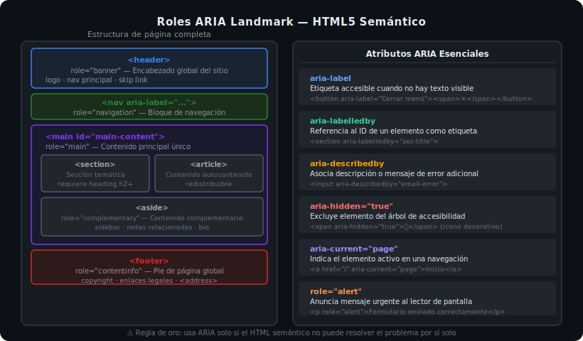

# Ejercicio 02 — ARIA: Formulario y Botones Accesibles

> Semana 13 · Práctica 02

## 🎯 Objetivo

Añadir atributos ARIA a un formulario de contacto y a botones con iconos, siguiendo las mejores prácticas de accesibilidad WCAG 2.1 AA.

---

## 🧠 Antes de empezar

Lee [02-accesibilidad-aria.md](../../1-teoria/02-accesibilidad-aria.md) y consulta el diagrama:



---

## 📂 Archivos

Trabaja en: `starter/index.html`

---

## Paso 1: `aria-label` en botones con solo iconos

La toolbar tiene botones con emojis/iconos pero **sin texto visible**. Los lectores de pantalla no entenderían qué hacen.

**Descomenta la sección PASO 1** para añadir `aria-label` descriptivo a cada botón de la toolbar.

```html
<!-- Sin ARIA — el lector dice "💾 botón" — ¿qué hace? -->
<button type="button">💾</button>

<!-- Con aria-label — el lector dice "Guardar cambios, botón" -->
<button type="button" aria-label="Guardar cambios">
  <span aria-hidden="true">💾</span>
</button>
```

---

## Paso 2: `aria-labelledby` y `aria-describedby` en el formulario

**Descomenta la sección PASO 2** para vincular el formulario con su título y cada campo con sus instrucciones de error.

```html
<!-- El form referencia el h2 como su nombre accesible -->
<form aria-labelledby="form-title">
  <h2 id="form-title">Formulario de contacto</h2>
  ...
</form>

<!-- El input describe su error con aria-describedby -->
<input
  type="email"
  aria-describedby="email-error"
  aria-invalid="true"
/>
<p id="email-error" role="alert">Correo inválido</p>
```

---

## Paso 3: `aria-hidden` en iconos decorativos

**Descomenta la sección PASO 3** para ocultar del árbol de accesibilidad los iconos que son puramente decorativos.

Sin `aria-hidden="true"` en el icono, el lector de pantalla diría:
> "Correo Electrónico etiqueta" (leyendo el emoji como texto)

Con `aria-hidden="true"`:
> "Correo Electrónico etiqueta"

---

## Paso 4: `aria-current="page"` en navegación activa

**Descomenta la sección PASO 4** para indicar al lector de pantalla cuál es la página actual en la navegación.

```html
<nav aria-label="Navegación principal">
  <ul>
    <li><a href="/inicio">Inicio</a></li>
    <li><a href="/contacto" aria-current="page">Contacto</a></li>
  </ul>
</nav>
```

---

## ✅ Verificación

1. Instala la extensión **axe DevTools** en Chrome o Firefox
2. Abre la página y ejecuta el análisis — debe mostrar 0 errores críticos
3. Navega con `Tab` — todos los elementos interactivos deben recibir foco con un outline visible
4. Si tienes lector de pantalla (NVDA, VoiceOver), navega por los elementos del formulario y verifica que cada campo tenga un nombre comprensible
